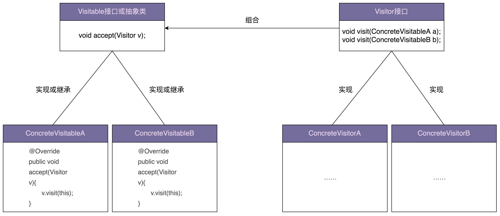

### 访问者模式
访问者模式定义：允许一个或者多个操作应用到一组对象上，解耦操作和对象本身。

访问者模式允许一个或者多个操作应用到一组对象上，**设计意图是解耦操作和对象本身，保持类职责单一、满足开闭原则以及应对代码的复杂性**。

定义比较简单，结合前面的例子不难理解，我就不过多解释了。对于访问者模式的代码实现，实际上，在上面例子中，经过层层重构之后的最终代码，就是标准的访问者模式的实现代码。这里，我又总结了一张类图，贴在了下面，你可以对照着前面的例子代码一块儿来看一下。



#### 代码示例图
```
public abstract class ResourceFile {
  protected String filePath;
  public ResourceFile(String filePath) {
    this.filePath = filePath;
  }
  abstract public void accept(Visitor vistor);
}

public class PdfFile extends ResourceFile {
  public PdfFile(String filePath) {
    super(filePath);
  }

  @Override
  public void accept(Visitor visitor) {
    visitor.visit(this);
  }

  //...
}
//...PPTFile、WordFile跟PdfFile类似，这里就省略了...

public interface Visitor {
  void visit(PdfFile pdfFile);
  void visit(PPTFile pdfFile);
  void visit(WordFile pdfFile);
}

public class Extractor implements Visitor {
  @Override
  public void visit(PPTFile pptFile) {
    //...
    System.out.println("Extract PPT.");
  }

  @Override
  public void visit(PdfFile pdfFile) {
    //...
    System.out.println("Extract PDF.");
  }

  @Override
  public void visit(WordFile wordFile) {
    //...
    System.out.println("Extract WORD.");
  }
}

public class Compressor implements Visitor {
  @Override
  public void visit(PPTFile pptFile) {
    //...
    System.out.println("Compress PPT.");
  }

  @Override
  public void visit(PdfFile pdfFile) {
    //...
    System.out.println("Compress PDF.");
  }

  @Override
  public void visit(WordFile wordFile) {
    //...
    System.out.println("Compress WORD.");
  }

}

public class ToolApplication {
  public static void main(String[] args) {
    Extractor extractor = new Extractor();
    List<ResourceFile> resourceFiles = listAllResourceFiles(args[0]);
    for (ResourceFile resourceFile : resourceFiles) {
      resourceFile.accept(extractor);
    }

    Compressor compressor = new Compressor();
    for(ResourceFile resourceFile : resourceFiles) {
      resourceFile.accept(compressor);
    }
  }

  private static List<ResourceFile> listAllResourceFiles(String resourceDirectory) {
    List<ResourceFile> resourceFiles = new ArrayList<>();
    //...根据后缀(pdf/ppt/word)由工厂方法创建不同的类对象(PdfFile/PPTFile/WordFile)
    resourceFiles.add(new PdfFile("a.pdf"));
    resourceFiles.add(new WordFile("b.word"));
    resourceFiles.add(new PPTFile("c.ppt"));
    return resourceFiles;
  }
}
```

一般来说，访问者模式针对的是一组类型不同的对象（PdfFile、PPTFile、WordFile）。不过，尽管这组对象的类型是不同的，但是，它们继承相同的父类（ResourceFile）或者实现相同的接口。在不同的应用场景下，我们需要对这组对象进行一系列不相关的业务操作（抽取文本、压缩等），但为了避免不断添加功能导致类（PdfFile、PPTFile、WordFile）不断膨胀，职责越来越不单一，以及避免频繁地添加功能导致的频繁代码修改，我们使用访问者模式，将对象与操作解耦，将这些业务操作抽离出来，定义在独立细分的访问者类（Extractor、Compressor）中。

### Single Dispatch 和 Double Dispatch
在面向对象编程语言中，方法调用可以理解为一种消息传递（Dispatch）。一个对象调用另一个对象的方法，就相当于给它发送一条消息，这条消息起码要包含对象名、方法名和方法参数。

所谓 Single Dispatch，指的是执行哪个对象的方法，根据对象的运行时类型来决定；执行对象的哪个方法，根据方法参数的编译时类型来决定。所谓 Double Dispatch，指的是执行哪个对象的方法，根据对象的运行时类型来决定；执行对象的哪个方法，根据方法参数的运行时类型来决定。

支持双分派（Double Dispatch）的语言不需要访问者模式

### 工厂模式VS访问者模式
如果工具提供的功能并不是非常多，只有几个而已，那我更推荐使用工厂模式的实现方式，毕竟代码更加清晰、易懂。相反，如果工具提供非常多的功能，比如有十几个，那我更推荐使用访问者模式，因为访问者模式需要定义的类要比工厂模式的实现方式少很多，类太多也会影响到代码的可维护性。
