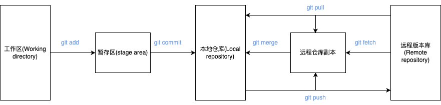

### Git基础概念

#### git是分布式版本控制系统

先说集中式版本控制系统，版本库是集中存放在中央服务器的。

例如SVN，代码直接保存在服务器上，写代码的时候，代码必须从中央服务器取得最新的版本，然后编写代码，然后再提交到服务器。在断网的情况下，SVN是无法拉取和提交代码的。

**git是分布式版本控制系统**。每个人的电脑上都是一个完整的版本库。最直观的例子是，git维护的代码，在断网的情况下也可以提交版本，保存到本地版本库。

和集中式版本控制系统相比，分布式版本控制系统的安全性要高很多，因为每个人电脑里都有完整的版本库，某一个人的电脑坏掉了不要紧，随便从其他人那里复制一个就可以了。而集中式版本控制系统的中央服务器要是出了问题，所有人都没法干活了。

当然在真实的开发环境下，还是会有一台充当“中央服务器”的机器，方便交换大家的代码修改，例如GitHub，Gitee，GitLab。

#### git结构介绍



##### 工作区(Working Directory)
就是你在电脑里能看到的目录，例如: 
```
D:\working_documents\git\lcdp-bld-staff
```

工作区的内容会包含提交到暂存区和版本库(当前提交点)的内容，同时也包含自己的修改内容。

##### 暂存区(Stage)

暂存区(stage area, 又称为索引区index)，是git中一个非常重要的概念。是我们把修改提交版本库前的一个过渡阶段。查看GIT自带帮助手册的时候，通常以index来表示暂存区。在工作目录下有一个.git的目录，里面有个index文件，存储着关于暂存区的内容。git add命令将工作区内容添加到暂存区。

我们把文件往Git版本库里添加的时候，是分两步执行的：

第一步是用git add把文件添加进去，实际上就是把文件修改添加到暂存区；

第二步是用git commit提交更改，实际上就是把暂存区的所有内容提交到当前分支。

通过 git status可以查看当前仓库的文件状态，包括工作区和暂存区

**注意！**
```
git commit只负责把暂存区的修改提交了。
如果修改并git add了一个文件之后，然后再次作二次修改，这个时候git commit后，第二次的修改时不会被提交的。
因为第二次修改没有放暂存区。
```

##### 本地仓库(local repository)

本地仓库(local repository)，版本控制系统的仓库，存在于本地。当执行git commit命令后，会将暂存区内容提交到仓库之中。在工作区下面有.git的目录，这个目录下的内容不属于工作区，里面便是仓库的数据信息，暂存区相关内容也在其中。这里也可以使用merge或rebase将远程仓库副本合并到本地仓库。图中的只有merge，注意这里也可以使用rebase。

##### 远程版本库(remote repository)
远程版本库(remote repository)，与本地仓库概念基本一致，不同之处在于一个存在远程，可用于远程协作，一个却是存在于本地。通过push/pull可实现本地与远程的交互；

##### 远程仓库副本
远程仓库副本，可以理解为存在于本地的远程仓库缓存。如需更新，可通过git fetch/pull命令获取远程仓库内容。使用fech获取时，并未合并到本地仓库，此时可使用git merge实现远程仓库副本与本地仓库的合并。git pull 根据配置的不同，可为git fetch + git merge 或 git fetch + git rebase。rebase和merge的区别可以自己去网上找些资料了解下。

#### git版本号

git的版本号是一个SHA1计算出来的一个非常大的数字，用十六进制表示。

为什么不能像SVN一样用递增数字来表示提交版本呢？

因为Git是分布式的版本控制系统，后面我们还要研究多人在同一个版本库里工作，如果大家都用1，2，3……作为版本号，那肯定就冲突了。

#### HEAD 指针
Git的版本回退速度非常快，因为Git在内部有个指向当前版本的HEAD指针，当你回退版本的时候，Git仅仅是把HEAD从指向对应的版本，然后顺便把工作区的文件更新了。所以你让HEAD指向哪个版本号，你就把当前版本定位在哪。

#### 所有的版本控制系统，其实只能跟踪文本文件的改动

git，SVN这些版本系统，都只能跟踪文件的改动。比如在第5行加了一个单词“Linux”，在第8行删了一个单词“Windows”。而图片、视频这些二进制文件，虽然也能由版本控制系统管理，但没法跟踪文件的变化，只能把二进制文件每次改动串起来，也就是只知道图片从100KB改成了120KB，但到底改了啥，版本控制系统不知道，也没法知道。

Word、Excel格式的文件都是二进制文件，Git是没有办法跟踪具体修改的内容的，只能展示有改动

### git 远程仓库操作

#### 关联远程仓库
适用于先有本地仓库，然后再想在远程创建仓库的情况

```
git remote add origin git@server-name:path/repo-name.git

关联一个远程库时必须给远程库指定一个名字，origin是默认习惯命名；
```

##### 推送代码到远程仓库
```
git push -u origin master第一次推送master分支的所有内容；

此后，每次本地提交后，只要有必要，就可以使用命令git push origin master推送最新修改；
```

##### 解除本地和远程的绑定关系
```
git remote rm origin

此处的“删除”其实是解除了本地和远程的绑定关系，并不是物理上删除了远程库。远程库本身并没有任何改动。要真正删除远程库，需要登录到GitHub，在后台页面找到删除按钮再删除。
```

#### 从远程库克隆
**一般工作上的开发操作，都是使用从远程仓库克隆的方法，而且实际操作更简单**

```
git clone [远程仓库链接]
```

##### 切换分支
```
只要远程仓库有对应的分支
直接 git checkout [分支] 完事

git 会直接与远程分支关联
```

##### 推送分支
```
只要当前分支与远程分支有关联，那么所有的提交都可以
直接 git push 完事
```

### git 分支管理
分支在实际中有什么用呢？假设你准备开发一个新功能，但是需要两周才能完成，第一周你写了50%的代码，如果立刻提交，由于代码还没写完，不完整的代码库会导致别人不能干活了。如果等代码全部写完再一次提交，又存在丢失每天进度的巨大风险。

现在有了分支，就不用怕了。你创建了一个属于你自己的分支，别人看不到，还继续在原来的分支上正常工作，而你在自己的分支上干活，想提交就提交，直到开发完毕后，再一次性合并到原来的分支上，这样，既安全，又不影响别人工作。

#### 分支概念
一条分支可以理解成一条代码提交的时间线，一般来说，所有的git仓库都有一条主分支，默认情况这条主分支叫master。

在工作开发过程中，master一般是作为生产环境的最终代码。

```
                                                      HEAD
                                                        │
                                                        │
                                                        ▼
                                                     master
                                                        │
                                                        │
                                                        ▼
┌───┐    ┌───┐    ┌───┐    ┌───┐    ┌───┐    ┌───┐    ┌───┐
│   │───>│   │───>│   │───>│   │───>│   │───>│   │───>│   │
└───┘    └───┘    └───┘    └───┘    └───┘    └───┘    └───┘
```

每次提交，分支都会向前移动一步，这样，随着你不断提交，分支的线也越来越长。

当我们创建新的分支，例如dev时，Git新建了一个指针叫dev，指向master相同的提交，再把HEAD指向dev，就表示当前分支在dev上：

```
                                                     master
                                                        │
                                                        │
                                                        ▼
┌───┐    ┌───┐    ┌───┐    ┌───┐    ┌───┐    ┌───┐    ┌───┐
│   │───>│   │───>│   │───>│   │───>│   │───>│   │───>│   │
└───┘    └───┘    └───┘    └───┘    └───┘    └───┘    └───┘
                                                        ▲
                                                        │
                                                        │
                                                       dev
                                                        ▲
                                                        │
                                                        │
                                                      HEAD
```

Git创建一个分支很快，因为除了增加一个dev指针，改改HEAD的指向，工作区的文件都没有任何变化！

不过，从现在开始，对工作区的修改和提交就是针对dev分支了，比如新提交一次后，dev指针往前移动一步，而master指针不变：

```
                                            master
                                               │
                                               │
                                               ▼
┌───┐    ┌───┐    ┌───┐    ┌───┐    ┌───┐    ┌───┐    ┌───┐
│   │───>│   │───>│   │───>│   │───>│   │───>│   │───>│   │
└───┘    └───┘    └───┘    └───┘    └───┘    └───┘    └───┘
                                                        ▲
                                                        │
                                                        │
                                                       dev
                                                        ▲
                                                        │
                                                        │
                                                      HEAD
```

假如我们在dev上的工作完成了，就可以把dev合并到master上。Git怎么合并呢？最简单的方法，就是直接把master指向dev的当前提交，就完成了合并：

```
                                                      HEAD
                                                        │
                                                        │
                                                        ▼
                                                     master
                                                        │
                                                        │
                                                        ▼
┌───┐    ┌───┐    ┌───┐    ┌───┐    ┌───┐    ┌───┐    ┌───┐
│   │───>│   │───>│   │───>│   │───>│   │───>│   │───>│   │
└───┘    └───┘    └───┘    └───┘    └───┘    └───┘    └───┘
                                                        ▲
                                                        │
                                                        │
                                                       dev
```

所以Git合并分支也很快！就改改指针，工作区内容也不变！

合并完分支后，甚至可以删除dev分支。删除dev分支就是把dev指针给删掉，删掉后，我们就剩下了一条master分支：

```
                                                      HEAD
                                                        │
                                                        │
                                                        ▼
                                                     master
                                                        │
                                                        │
                                                        ▼
┌───┐    ┌───┐    ┌───┐    ┌───┐    ┌───┐    ┌───┐    ┌───┐
│   │───>│   │───>│   │───>│   │───>│   │───>│   │───>│   │
└───┘    └───┘    └───┘    └───┘    └───┘    └───┘    └───┘
```

#### 分支冲突解决
在多人合作的项目中，分支合并时发生合并冲突时正常的，花点时间解决即可。下面大概介绍一下分支冲突概念及解决方法。

##### 产生冲突的原因
当两个分支同时修改同一个文件，并且产生合并操作时，非常大概率会产生分支冲突。

例如现在有一个master分支，然后在某个时间点有人切换了一个feature1。然后master和feature1分支分别都对同一个文件产生了提交，而且提交的都是同一段的代码，那么这个时候git就不知道分支合并时，**应该怎么记录这段代码的改动了**。

```
                            HEAD
                              │
                              │
                              ▼
                           master
                              │
                              │
                              ▼
                            ┌───┐
                         ┌─>│   │
┌───┐    ┌───┐    ┌───┐  │  └───┘
│   │───>│   │───>│   │──┤
└───┘    └───┘    └───┘  │  ┌───┐
                         └─>│   │
                            └───┘
                              ▲
                              │
                              │
                          feature1
```

##### 冲突解决方法
产生冲突，那就解决冲突呗。git不知道怎么记录两条分支的改动，那就人为确定改动情况就完事了。

具体解决如下：

一般工作时，都是一个分支合并到主分支的，例如feature1提交合并请求，合并到master

1. 先更新master和feature1两个分支的代码，保证分支是最新的
2. 切到feature1分支，执行git merge master命令，合并后，当前feature1分支就会出现合并master时的冲突情况
3. 这个时候使用git status命令查看当前feature1的冲突情况
4. 找到合并冲突的文件，然后手动修改冲突文件
5. 修改完冲突文件后，使用git add命令提交冲突文件到暂存区，并且使用git commit命令提交所有的合并变更，相当于给冲突文件打上一个标签，说明这个文件的冲突已经解决，具体合并后的变更情况是这样的，这个时候git就能识别出冲突文件的改动了。
6. 使用git push命令把本地修改提交到远程仓库，继续分支合并操作，一般提交后分支就自动合并了

注意：
```
如果不是远程提交，那么直接切换到master分支，然后操作git merge feature1，然后按照3-5步骤解决冲突即可
```

现在，master分支和feature1分支变成了下图所示：

```
                                     HEAD
                                       │
                                       │
                                       ▼
                                    master
                                       │
                                       │
                                       ▼
                            ┌───┐    ┌───┐
                         ┌─>│   │───>│   │
┌───┐    ┌───┐    ┌───┐  │  └───┘    └───┘
│   │───>│   │───>│   │──┤             ▲
└───┘    └───┘    └───┘  │  ┌───┐      │
                         └─>│   │──────┘
                            └───┘
                              ▲
                              │
                              │
                          feature1
```

#### 分支合并错误怎么办？
在日常开发过程中，经常有两个版本的分支并行开发的过程。如果发现这两个版本分支错误合并到一起，该如何解决呢？

例如：
```
现在当前日期是2024年2月22日，现在有0224和0309两个版本的分支，分别需要在0224和0309上线。

这个时候，有同事错误的把自己的0309分支合并到0224分支

当前分支:
0224
0309
0309_A // A同事分支

错误操作:
0309_A合并到0224分支
```

```
这种情况一般已经十万火急了，还有1天就要上线了，然后发现代码错乱了。

但是，千万别急，越急操作越乱

曾经有老师，错误合并了分支，然后又错误操作点击了回退操作。确实回退完之后，分支没有问题了，但是却留下了发版后，合并下版本分支的后遗症。
然后组织了所有涉及开发的同事，花了大半天时间来解决版本合并的冲突。
```

推荐操作:

1. 找到分支错误合并前的最后一次提交 commit_1
2. 找到分支误合并后，所有正确的提交 commit_2,commit_3,...
3. 通过git reset --hard commit_1命令回退版本
4. 通过 git cherry-pick commit_2,git cherry-pick commit_3,... 把一个一个正确提价的代码补上
5. 然后再通过 git push -f 强制更新远程版本分支

```
错误合并分支的修复过程非常繁琐，所以千万不要错误合并分支，不然代价非常巨大
```

### 关于各种git的可视化工具

本质上这些工具都是基于git的核心代码来运行的，就像Ubuntu等基于各种Gnome、KDE、Xfce等桌面环境组件整合成的系统发行版，其内核系统调用都是基于Linux内核一样

### Git常用命令

#### git status 查看仓库当前的状态
```
git status 这个命令无论什么时候都可以使用，它就相当于项目的监视器，监听当前的项目状态，然后提出一些修改建议。

其作用场景大概如下：
1.查看当前工程的提交状态，查看工作区和暂存区的改动情况
2.在代码合并冲突时可以看到具体的合并文件及冲突文件(产生冲突时特别好用)
3.git status一般都会给出当前项目状态的命令建议，你可以提交代码，或者撤销合并、撤销提交到暂存区的代码、或者撤销工作区的改动等

```

#### git分支相关命令

```
查看分支：git branch

创建分支：git branch <name>

切换分支：git checkout <name>或者git switch <name>

创建+切换分支：git checkout -b <name>或者git switch -c <name>

合并某分支到当前分支：git merge <name>

删除分支：git branch -d <name>
```

#### git远程仓库操作相关

##### git remote
```
// 查看远程库信息
git remote -v

// 解除了本地和远程的绑定关系。此处的“删除”其实是解除了本地和远程的绑定关系，并不是物理上删除了远程库。远程库本身并没有任何改动。要真正删除远程库，需要登录到GitHub，在后台页面找到删除按钮再删除。
git remote rm origin

// 关联一个远程仓库，关联一个远程库时必须给远程库指定一个名字，origin是默认习惯命名；
git remote add origin git@server-name:path/repo-name.git
```

##### git push
```
// 第一次推送代码到远程分支
git push -u origin <branch name>

// 推送指定分支到远程
git push origin <branch name>
```

##### git fetch
FETCH_HEAD： 是一个版本链接，记录在本地的一个文件中，指向着目前已经从远程仓库取下来的分支的末端版本。

commit-id：在每次本地工作完成后，都会做一个git commit 操作来保存当前工作到本地的repo， 此时会产生一个commit-id，这是一个能唯一标识一个版本的序列号。 在使用git push后，这个序列号还会同步到远程仓库。

有了以上的概念再来说说git fetch

git fetch：这将更新git remote 中所有的远程仓库所包含分支的最新commit-id, 将其记录到.git/FETCH_HEAD文件中

git fetch更新远程仓库的方式如下：
```
git fetch <远程主机名> //这个命令将某个远程主机的更新全部取回本地

// 最常见的命令如取回origin 主机的master 分支
git fetch origin master

//在本地新建一个temp分支，并将远程origin仓库的master分支代码下载到本地temp分支
git fetch origin master:tmp 

//来比较本地代码与刚刚从远程下载下来的代码的区别
git diff tmp 

//合并temp分支到本地的master分支
git merge tmp

//如果不想保留temp分支 可以用这步删除
git branch -d temp
```

（1）如果直接使用git fetch，则步骤如下：

创建并更新本 地远程分支。即创建并更新origin/xxx 分支，拉取代码到origin/xxx分支上。

在FETCH_HEAD中设定当前分支origin/当前分支对应，如直接到时候git merge就可以将origin/abc合并到abc分支上。

（2）git fetch origin

只是手动指定了要fetch的remote。在不指定分支时通常默认为master

（3）git fetch origin dev

指定远程remote和FETCH_HEAD，并且只拉取该分支的提交。

##### git pull

```
git pull 的过程可以理解为

git fetch origin master //从远程主机的master分支拉取最新内容 

git merge FETCH_HEAD    //将拉取下来的最新内容合并到当前所在的分支中
```

##### 创建和远程对应的分支
```
// 在本地创建和远程分支对应的分支，本地和远程分支的名称最好一致；
git checkout -b branch-name origin/branch-name
```

##### 建立本地分支和远程分支的关联
```
// 建立本地分支和远程分支的关联
git branch --set-upstream branch-name origin/branch-name
```

#### git diff 查看修改情况

#### git log 查看提交记录

```
git log --graph // 命令可以看到分支合并图

// 可以看到返回的信息包括更新的文件名，更新的作者和时间，以及更新的代码
git log -p FETCH_HEAD
```

#### git reset 版本回退

```
git reset --hard commit_id
```

#### git reflog 查看命令历史，以便确定要回到未来的哪个版本

#### git stash 暂存当前修改文件
当你在dev分支上编写一个功能的时候，突然你收到了一个紧急bug需要马上修复，但是这个功能编写只编写到50%，距离编写完成还有1天的时间。

这个时候，使用git stash命令可以让你马上把你当前提交的内容都缓存起来，执行完命令后，dev分支就像没有作过任何提交一样干净，这个时候就可以修复bug，然后提交合并了。

bug修复完后，你又想把你暂存的修改给拿出来，这个时候只需要执行 git stash pop把暂存的代码拿出来继续编写了。

相关命令:
```
// 暂存工作区代码
git stash

// 查看所有暂存的代码
git stash list

// 恢复暂存代码，但是暂存代码仍保留修改
git stash apply [暂存代码编号，如：stash@{0} 可选]

// 删除暂存代码
git stash drop [暂存代码编号，如：stash@{0} 可选]

// 把暂存代码取出，并且删除暂存代码
git stash pop [暂存代码编号，如：stash@{0} 可选]
```

#### git cherry-pick 把某次提交的改动应用到当前分支
```
// 把某个提交的修改“复制”到当前分支，避免重复劳动。注意：复制改动，是会生成一个新的提交id的
git cherry-pick <commit> 
```
