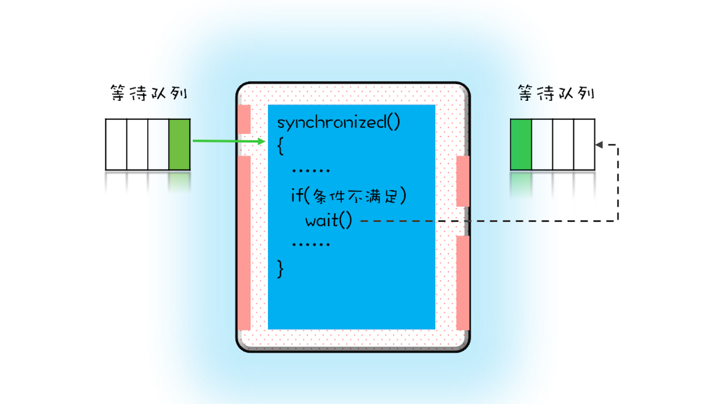

### 等待 - 通知
一个完整的等待 - 通知机制：线程首先获取互斥锁，当线程要求的条件不满足时，释放互斥锁，进入等待状态；当要求的条件满足时，通知等待的线程，重新获取互斥锁。

### 用 synchronized 实现等待 - 通知机制
在 Java 语言里，等待 - 通知机制可以有多种实现方式，比如 Java 语言内置的 synchronized 配合 wait()、notify()、notifyAll() 这三个方法就能轻松实现。

在下面这个图里，左边有一个等待队列，同一时刻，只允许一个线程进入 synchronized 保护的临界区（这个临界区可以看作大夫的诊室），当有一个线程进入临界区后，其他线程就只能进入图中左边的等待队列里等待（相当于患者分诊等待）。这个等待队列和互斥锁是一对一的关系，每个互斥锁都有自己独立的等待队列。



在并发程序中，当一个线程进入临界区后，由于某些条件不满足，需要进入等待状态，Java 对象的 wait() 方法就能够满足这种需求。如上图所示，当调用 wait() 方法后，当前线程就会被阻塞，并且进入到右边的等待队列中，**这个等待队列也是互斥锁的等待队列**。 线程在进入等待队列的同时，**会释放持有的互斥锁**，线程释放锁后，其他线程就有机会获得锁，并进入临界区了。

那线程要求的条件满足时，该怎么通知这个等待的线程呢？很简单，就是 Java 对象的 notify() 和 notifyAll() 方法。我在下面这个图里为你大致描述了这个过程，当条件满足时调用 notify()，会通知等待队列（**互斥锁的等待队列**）中的线程，告诉它**条件曾经满足过**。


为什么说是曾经满足过呢？因为 **notify() 只能保证在通知时间点，条件是满足的**。而被通知线程的**执行时间点和通知的时间点基本上不会重合**，所以当线程执行的时候，很可能条件已经不满足了（保不齐有其他线程插队）。这一点你需要格外注意。

上面我们一直强调 wait()、notify()、notifyAll() 方法操作的等待队列是互斥锁的等待队列，所以如果 synchronized 锁定的是 this，那么对应的一定是 this.wait()、this.notify()、this.notifyAll()；如果 synchronized 锁定的是 target，那么对应的一定是 target.wait()、target.notify()、target.notifyAll() 。而且 wait()、notify()、notifyAll() 这三个方法能够被调用的前提是已经获取了相应的互斥锁，所以我们会发现 wait()、notify()、notifyAll() 都是在 synchronized{}内部被调用的。如果在 synchronized{}外部调用，或者锁定的 this，而用 target.wait() 调用的话，JVM 会抛出一个运行时异常：java.lang.IllegalMonitorStateException。

实例：
```
class Allocator {
  private List<Object> als;
  // 一次性申请所有资源
  synchronized void apply(
    Object from, Object to){
    // 经典写法
    while(als.contains(from) ||
         als.contains(to)){
      try{
        wait();
      }catch(Exception e){
      }   
    } 
    als.add(from);
    als.add(to);  
  }
  // 归还资源
  synchronized void free(
    Object from, Object to){
    als.remove(from);
    als.remove(to);
    notifyAll();
  }
}
```

### 尽量使用 notifyAll()
在上面的代码中，我用的是 notifyAll() 来实现通知机制，为什么不使用 notify() 呢？这二者是有区别的，**notify() 是会随机地通知等待队列中的一个线程，而 notifyAll() 会通知等待队列中的所有线程**。从感觉上来讲，应该是 notify() 更好一些，因为即便通知所有线程，也只有一个线程能够进入临界区。但那所谓的感觉往往都蕴藏着风险，实际上使用 notify() 也很有风险，它的风险在于可能导致某些线程永远不会被通知到。
