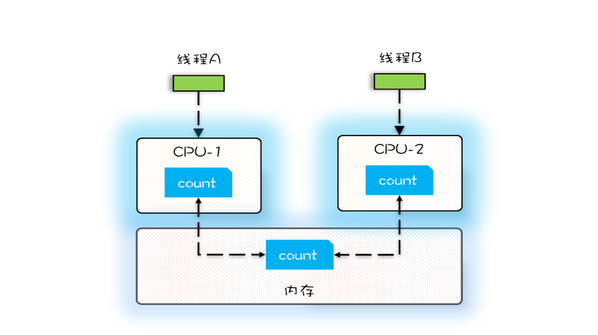

并发程序经常出现的诡异问题看上去非常无厘头，但是深究的话，无外乎就是直觉欺骗了我们，只要我们能够深刻理解可见性、原子性、有序性在并发场景下的原理，很多并发 Bug 都是可以理解、可以诊断的。

在介绍可见性、原子性、有序性的时候，特意提到**缓存导致的可见性问题，线程切换带来的原子性问题，编译优化带来的有序性问题**，其实缓存、线程、编译优化的目的和我们写并发程序的目的是相同的，都是提高程序性能。但是技术在解决一个问题的同时，必然会带来另外一个问题，所以在采用一项技术的同时，一定要清楚它带来的问题是什么，以及如何规避。

#### 源头之一：缓存导致的可见性问题
多核时代，**每颗 CPU 都有自己的缓存**，这时 CPU 缓存与内存的数据一致性就没那么容易解决了，当多个线程在不同的 CPU 上执行时，这些线程操作的是不同的 CPU 缓存。比如下图中，线程 A 操作的是 CPU-1 上的缓存，而线程 B 操作的是 CPU-2 上的缓存，很明显，这个时候线程 A 对变量 V 的操作对于线程 B 而言就不具备可见性了。这个就属于硬件程序员给软件程序员挖的“坑”。

#### 源头之二：线程切换带来的原子性问题

高级语言里一条语句往往需要多条 CPU 指令完成，例如上面代码中的count += 1，至少需要三条 CPU 指令。

- 指令 1：首先，需要把变量 count 从内存加载到 CPU 的寄存器；
- 指令 2：之后，在寄存器中执行 +1 操作；
- 指令 3：最后，将结果写入内存（缓存机制导致可能写入的是 CPU 缓存而不是内存）。

**操作系统做任务切换，可以发生在任何一条 CPU 指令执行完，是的，是 CPU 指令，而不是高级语言里的一条语句**。

对于上面的三条指令来说，我们假设 count=0，如果线程 A 在指令 1 执行完后做线程切换，线程 A 和线程 B 按照下图的序列执行，那么我们会发现两个线程都执行了 count+=1 的操作，但是得到的结果不是我们期望的 2，而是 1。

我们潜意识里面觉得 count+=1 这个操作是一个不可分割的整体，就像一个原子一样，线程的切换可以发生在 count+=1 之前，也可以发生在 count+=1 之后，但就是不会发生在中间。**我们把一个或者多个操作在 CPU 执行的过程中不被中断的特性称为原子性**。*CPU 能保证的原子操作是 CPU 指令级别的，而不是高级语言的操作符，这是违背我们直觉的地方。因此，很多时候我们需要在高级语言层面保证操作的原子性*。

#### 源头之三：编译优化带来的有序性问题
那并发编程里还有没有其他有违直觉容易导致诡异 Bug 的技术呢？有的，就是有序性。顾名思义，有序性指的是程序按照代码的先后顺序执行。编译器为了优化性能，有时候会改变程序中语句的先后顺序，例如程序中：“a=6；b=7；”编译器优化后可能变成“b=7；a=6；”，在这个例子中，编译器调整了语句的顺序，但是不影响程序的最终结果。不过有时候编译器及解释器的优化可能导致意想不到的 Bug。
