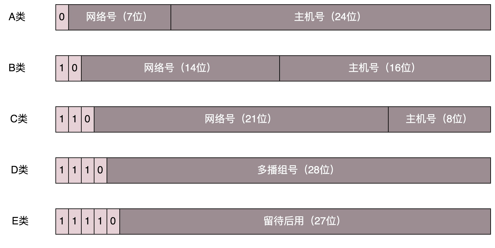

### ipv4
#### ipv4网络类型
32位ip地址有5类，A、B、C、D、E，现在的ipv4地址已经不够用了

D类是**组播地址**。使用这一类地址，属于某个组的机器都能收到。这有点类似在公司里面大家都加入了一个邮件组。发送邮件，加入这个组的都能收到。

对于 A、B、 C 类主要分两部分，前面一部分是**网络号**，后面一部分是**主机号**。



#### 无类型域间选路（CIDR）

##### ip addr demo
```
root@test:~# ip addr
1: lo: <LOOPBACK,UP,LOWER_UP> mtu 65536 qdisc noqueue state UNKNOWN group default 
    link/loopback 00:00:00:00:00:00 brd 00:00:00:00:00:00
    inet 127.0.0.1/8 scope host lo
       valid_lft forever preferred_lft forever
    inet6 ::1/128 scope host 
       valid_lft forever preferred_lft forever
2: eth0: <BROADCAST,MULTICAST,UP,LOWER_UP> mtu 1500 qdisc pfifo_fast state UP group default qlen 1000
    link/ether fa:16:3e:c7:79:75 brd ff:ff:ff:ff:ff:ff
    inet 10.100.122.2/24 brd 10.100.122.255 scope global eth0
       valid_lft forever preferred_lft forever
    inet6 fe80::f816:3eff:fec7:7975/64 scope link 
       valid_lft forever preferred_lft forever
```

CIDR打破了原来设计的几类地址的做法，将 32 位的 IP 地址一分为二，前面是**网络号**，后面是**主机号**。从哪里分呢？你如果注意观察的话可以看到，10.100.122.2/24，这个 IP 地址中有一个斜杠，斜杠后面有个数字 24。这种地址表示形式，就是 CIDR。后面 24 的意思是，32 位中，前 24 位是网络号，后 8 位是主机号。

伴随着 CIDR 存在的，一个是**广播地址**，10.100.122.255。如果发送这个地址，所有 10.100.122 网络里面的机器都可以收到。另一个是**子网掩码**，255.255.255.0。

将子网掩码和 IP 地址进行 AND 计算。前面三个 255，转成二进制都是 1。1 和任何数值取 AND，都是原来数值，因而前三个数不变，为 10.100.122。后面一个 0，转换成二进制是 0，0 和任何数值取 AND，都是 0，因而最后一个数变为 0，合起来就是 10.100.122.0。这就是网络号。**将子网掩码和 IP 地址按位计算 AND，就可得到网络号**。

### 公有 IP 地址和私有 IP 地址


表格最右列是私有 IP 地址段。平时我们看到的数据中心里，办公室、家里或学校的 IP 地址，一般都是私有 IP 地址段。因为这些地址允许组织内部的 IT 人员自己管理、自己分配，而且可以重复。

公有 IP 地址有个组织统一分配，你需要去买。如果你搭建一个网站，给你学校的人使用，让你们学校的 IT 人员给你一个 IP 地址就行。但是假如你要做一个类似网易 163 这样的网站，就需要有公有 IP 地址，这样全世界的人才能访问。

表格中的 192.168.0.x 是最常用的私有 IP 地址。你家里有 Wi-Fi，对应就会有一个 IP 地址。一般你家里地上网设备不会超过 256 个，所以 /24 基本就够了。有时候我们也能见到 /16 的 CIDR，这两种是最常见的，也是最容易理解的。

不需要将十进制转换为二进制 32 位，就能明显看出 192.168.0 是网络号，后面是主机号。而整个网络里面的第一个地址 192.168.0.1，往往就是你这个私有网络的出口地址。**例如，你家里的电脑连接 Wi-Fi，Wi-Fi 路由器的地址就是 192.168.0.1，而 192.168.0.255 就是广播地址**。一旦发送这个地址，整个 192.168.0 网络里面的所有机器都能收到。

### 关键字
网络号：主机号

广播地址

子网掩码

公有 IP 地址和私有 IP 地址

私有网络的出口地址（一般是主机号的第一号，如192.168.0.1）