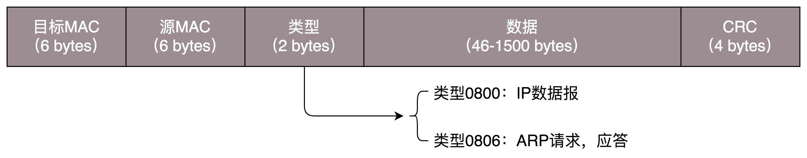
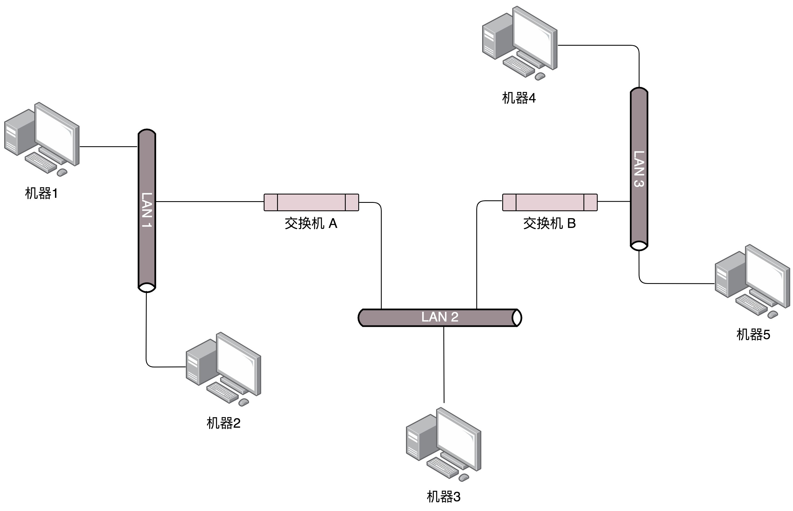
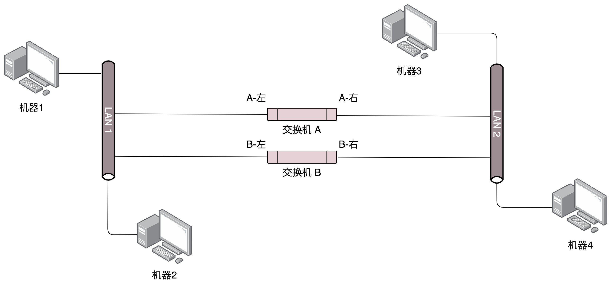
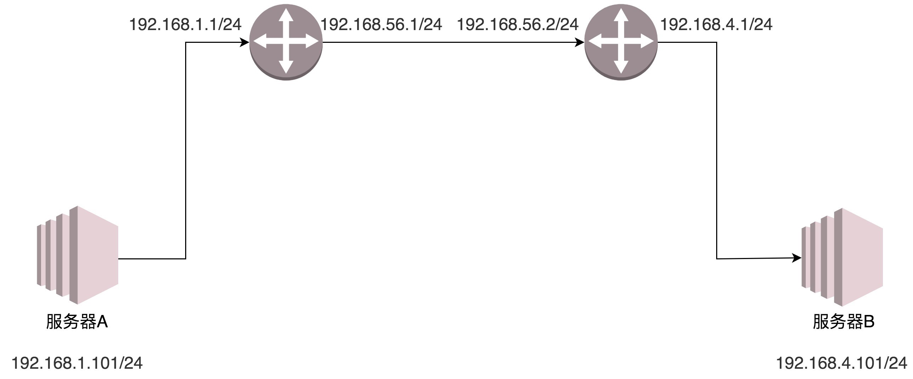
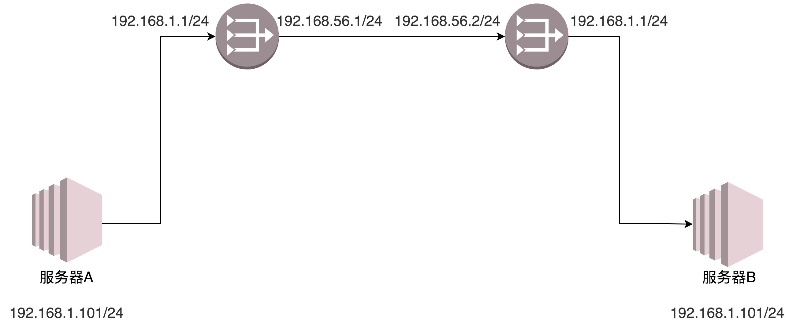
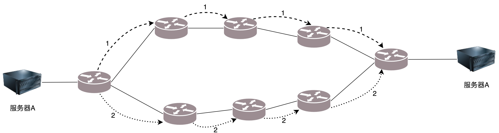

### 网线
电脑连电脑的水晶头要用**1－3、2－6 交叉接法**。

> 后来的网线不需要交叉接法也可以连通了

水晶头的第 1、2 和第 3、6 脚，它们分别起着收、发信号的作用。将一端的 1 号和 3 号线、2 号和 6 号线互换一下位置，就能够在物理层实现一端发送的信号，另一端能收到。

当然电脑连电脑，除了网线要交叉，还需要配置这两台电脑的 IP 地址、子网掩码和默认网关。这三个概念上一节详细描述过了。要想两台电脑能够通信，这三项必须配置成为一个网络，可以一个是 192.168.0.1/24，另一个是 192.168.0.2/24，否则是不通的。

这里我想问你一个问题，两台电脑之间的网络包，包含 MAC 层吗？当然包含，要完整。IP 层要封装了 MAC 层才能将包放入物理层。

到此为止，两台电脑已经构成了一个最小的**局域网**，也即 **LAN**。

### 集线器（Hub）
集线器这种设备有多个口，可以将宿舍里的多台电脑连接起来。但是，和交换机不同，集线器没有大脑，它完全在物理层工作。它会将自己收到的每一个字节，都复制到其他端口上去。这是第一层物理层联通的方案。

你可能已经发现问题了。Hub 采取的是广播的模式，如果每一台电脑发出的包，宿舍的每个电脑都能收到，那就麻烦了。这就需要解决几个问题：

1. 这个包是发给谁的？谁应该接收？
2. 大家都在发，会不会产生混乱？有没有谁先发、谁后发的规则？
3. 如果发送的时候出现了错误，怎么办？

这几个问题，都是第二层，数据链路层，也即 MAC 层要解决的问题。**MAC** 的全称是 **Medium Access Control**，即**媒体访问控制**。**控制什么呢？其实就是控制在往媒体上发数据的时候，谁先发、谁后发的问题。防止发生混乱。这解决的是第二个问题。这个问题中的规则，学名叫多路访问**。有很多算法可以解决这个问题。就像车管所管束马路上跑的车，能想的办法都想过了。

- 方式一：分多个车道。每个车一个车道，你走你的，我走我的。这在计算机网络里叫作**信道划分**；
- 方式二：今天单号出行，明天双号出行，轮着来。这在计算机网络里叫作**轮流协议**；
- 方式三：不管三七二十一，有事儿先出门，发现特堵，就回去。错过高峰再出。我们叫作**随机接入协议**。著名的以太网，用的就是这个方式。

接下来要解决第一个问题：发给谁，谁接收？这里用到一个物理地址，叫作**链路层地址**。**但是因为第二层主要解决媒体接入控制的问题，所以它常被称为MAC 地址**

接下来是**类型**，大部分的类型是 IP 数据包，然后 IP 里面包含 TCP、UDP，以及 HTTP 等，这都是里层封装的事情。

对于以太网，第二层的最后面是 **CRC**，也就是**循环冗余检测**。通过 XOR 异或的算法，来计算整个包是否在发送的过程中出现了错误，主要解决第三个问题。

这里还有一个没有解决的问题，当源机器知道目标机器的时候，可以将目标地址放入包里面，如果不知道呢？一个广播的网络里面接入了 N 台机器，我怎么知道每个 MAC 地址是谁呢？这就是 ARP 协议，也就是已知 IP 地址，求 MAC 地址的协议。

为了避免每次都用 ARP 请求，机器本地也会进行 ARP 缓存。当然机器会不断地上线下线，IP 也可能会变，所以 ARP 的 MAC 地址缓存过一段时间就会过期。

### 交换机
这种组网的方法，对一个宿舍来说没有问题，但是一旦机器数目增多，问题就出现了。因为 Hub 是广播的，不管某个接口是否需要，所有的 Bit 都会被发送出去，然后让主机来判断是不是需要。这种方式路上的车少就没问题，车一多，产生冲突的概率就提高了。而且把不需要的包转发过去，纯属浪费。看来 Hub 这种不管三七二十一都转发的设备是不行了，需要点儿智能的。因为每个口都只连接一台电脑，这台电脑又不怎么换 IP 和 MAC 地址，只要记住这台电脑的 MAC 地址，如果目标 MAC 地址不是这台电脑的，这个口就不用转发了。

谁能知道目标 MAC 地址是否就是连接某个口的电脑的 MAC 地址呢？这就需要一个能把 MAC 头拿下来，检查一下目标 MAC 地址，然后根据策略转发的设备，这个设备显然是个二层设备，我们称为**交换机**。

交换机怎么知道每个口的电脑的 MAC 地址呢？这需要交换机会学习。

一台 MAC1 电脑将一个包发送给另一台 MAC2 电脑，当这个包到达交换机的时候，一开始交换机也不知道 MAC2 的电脑在哪个口，所以没办法，它只能将包转发给除了来的那个口之外的其他所有的口。但是，这个时候，交换机会干一件非常聪明的事情，就是交换机会记住，MAC1 是来自一个明确的口。以后有包的目的地址是 MAC1 的，直接发送到这个口就可以了。

当交换机作为一个关卡一样，过了一段时间之后，就有了整个网络的一个结构了，这个时候，基本上不用广播了，全部可以准确转发。当然，每个机器的 IP 地址会变，所在的口也会变，因而交换机上的学习的结果，我们称为**转发表**，是有一个过期时间的。

### 拓扑结构
**交换机之间连接起来**，就形成一个稍微复杂的**拓扑结构**。

我们先来看两台交换机的情形。两台交换机连接着三个局域网，每个局域网上都有多台机器。如果机器 1 只知道机器 4 的 IP 地址，当它想要访问机器 4，把包发出去的时候，它必须要知道机器 4 的 MAC 地址。

于是机器 1 发起广播，机器 2 收到这个广播，但是这不是找它的，所以没它什么事。交换机 A 一开始是不知道任何拓扑信息的，在它收到这个广播后，采取的策略是，除了广播包来的方向外，它还要转发给其他所有的网口。于是机器 3 也收到广播信息了，但是这和它也没什么关系。

当然，交换机 B 也是能够收到广播信息的，但是这时候它也是不知道任何拓扑信息的，因而也是进行广播的策略，将包转发到局域网三。这个时候，机器 4 和机器 5 都收到了广播信息。机器 4 主动响应说，这是找我的，这是我的 MAC 地址。于是一个 ARP 请求就成功完成了。

在上面的过程中，交换机 A 和交换机 B 都是能够学习到这样的信息：机器 1 是在左边这个网口的。当了解到这些拓扑信息之后，情况就好转起来。当机器 2 要访问机器 1 的时候，机器 2 并不知道机器 1 的 MAC 地址，所以机器 2 会发起一个 ARP 请求。这个广播消息会到达机器 1，也同时会到达交换机 A。这个时候交换机 A 已经知道机器 1 是不可能在右边的网口的，所以这个广播信息就不会广播到局域网二和局域网三。

当机器 3 要访问机器 1 的时候，也需要发起一个广播的 ARP 请求。这个时候交换机 A 和交换机 B 都能够收到这个广播请求。交换机 A 当然知道主机 A 是在左边这个网口的，所以会把广播消息转发到局域网一。同时，交换机 B 收到这个广播消息之后，由于它知道机器 1 是不在右边这个网口的，所以不会将消息广播到局域网三。

#### 常见的环路问题
当两个交换机将两个局域网同时连接起来的时候。你可能会觉得，这样反而有了高可用性。但是却不幸地出现了环路。出现了环路会有什么结果呢？

我们来想象一下机器 1 访问机器 2 的过程。一开始，机器 1 并不知道机器 2 的 MAC 地址，所以它需要发起一个 ARP 的广播。广播到达机器 2，机器 2 会把 MAC 地址返回来，看起来没有这两个交换机什么事情。

但是问题来了，这两个交换机还是都能够收到广播包的。交换机 A 一开始是不知道机器 2 在哪个局域网的，所以它会把广播消息放到局域网二，在局域网二广播的时候，交换机 B 右边这个网口也是能够收到广播消息的。交换机 B 会将这个广播信息发送到局域网一。局域网一的这个广播消息，又会到达交换机 A 左边的这个接口。交换机 A 这个时候还是不知道机器 2 在哪个局域网，于是将广播包又转发到局域网二。左转左转左转，好像是个圈哦。

可能有人会说，当两台交换机都能够逐渐学习到拓扑结构之后，是不是就可以了？

别想了，压根儿学不会的。机器 1 的广播包到达交换机 A 和交换机 B 的时候，本来两个交换机都学会了机器 1 是在局域网一的，但是当交换机 A 将包广播到局域网二之后，交换机 B 右边的网口收到了来自交换机 A 的广播包。根据学习机制，这彻底损坏了交换机 B 的三观，刚才机器 1 还在左边的网口呢，怎么又出现在右边的网口呢？哦，那肯定是机器 1 换位置了，于是就误会了，交换机 B 就学会了，机器 1 是从右边这个网口来的，把刚才学习的那一条清理掉。同理，交换机 A 右边的网口，也能收到交换机 B 转发过来的广播包，同样也误会了，于是也学会了，机器 1 从右边的网口来，不是从左边的网口来。

然而当广播包从左边的局域网一广播的时候，两个交换机再次刷新三观，原来机器 1 是在左边的，过一会儿，又发现不对，是在右边的，过一会，又发现不对，是在左边的。

这还是一个包转来转去，每台机器都会发广播包，交换机转发也会复制广播包，当广播包越来越多的时候，按照上一节讲过一个共享道路的算法，也就是路会越来越堵，最后谁也别想走。所以，必须有一个方法解决环路的问题，怎么破除环路呢？

这个时候需要用到**STP协议**
[layer2链路层#STP协议](layer2链路层.md "layer2链路层")

### 路由器
**网关往往是一个路由器，是一个三层转发的设备**。啥叫三层设备？前面也说过了，就是把 MAC 头和 IP 头都取下来，然后根据里面的内容，看看接下来把包往哪里转发的设备。

很多情况下，人们把网关就叫做路由器。其实不完全准确，而另一种比喻更加恰当：**路由器是一台设备，它有五个网口或者网卡，相当于有五只手，分别连着五个局域网。每只手的 IP 地址都和局域网的 IP 地址相同的网段，每只手都是它握住的那个局域网的网关**。

任何一个想发往其他局域网的包，都会到达其中一只手，被拿进来，拿下 MAC 头和 IP 头，看看，根据自己的路由算法，选择另一只手，加上 IP 头和 MAC 头，然后扔出去。

路由器就是一台网络设备，它有多张网卡。当一个入口的网络包送到路由器时，它会根据一个本地的转发信息库，来决定如何正确地转发流量。这个转发信息库通常被称为**路由表**。

一张路由表中会有多条路由规则。每一条规则至少包含这三项信息。

- 目的网络：这个包想去哪儿？
- 出口设备：将包从哪个口扔出去？
- 下一跳网关：下一个路由器的地址。

通过 route 命令和 ip route 命令都可以进行查询或者配置。

例如，我们设置 ip route add 10.176.48.0/20 via 10.173.32.1 dev eth0，就说明要去 10.176.48.0/20 这个目标网络，要从 eth0 端口出去，经过 10.173.32.1。

#### 静态路由

对于 IP 头和 MAC 头哪些变、哪些不变的问题，可以分两种类型。MAC 地址是一个局域网内才有效的地址。因而，MAC 地址只要过网关，就必定会改变，因为已经换了局域网。两者主要的区别在于 IP 地址是否改变。**不改变 IP 地址的网关，我们称为转发网关**；**改变 IP 地址的网关，我们称为NAT 网关**。

##### 转发网关
转发网关例子：

服务器 A 要访问服务器 B。首先，服务器 A 会思考，192.168.4.101 和我不是一个网段的，因而需要先发给网关。那网关是谁呢？已经静态配置好了，网关是 192.168.1.1。网关的 MAC 地址是多少呢？发送 ARP 获取网关的 MAC 地址，然后发送包。包的内容是这样的：

- 源 MAC：服务器 A 的 MAC
- 目标 MAC：192.168.1.1 这个网口的 MAC
- 源 IP：192.168.1.101
- 目标 IP：192.168.4.101

包到达 192.168.1.1 这个网口，发现 MAC 一致，将包收进来，开始思考往哪里转发。

在路由器 A 中配置了静态路由之后，要想访问 192.168.4.0/24，要从 192.168.56.1 这个口出去，下一跳为 192.168.56.2。

于是，路由器 A 思考的时候，匹配上了这条路由，要从 192.168.56.1 这个口发出去，发给 192.168.56.2，那 192.168.56.2 的 MAC 地址是多少呢？路由器 A 发送 ARP 获取 192.168.56.2 的 MAC 地址，然后发送包。包的内容是这样的：

- 源 MAC：192.168.56.1 的 MAC 地址
- 目标 MAC：192.168.56.2 的 MAC 地址
- 源 IP：192.168.1.101
- 目标 IP：192.168.4.101

包到达 192.168.56.2 这个网口，发现 MAC 一致，将包收进来，开始思考往哪里转发。

在路由器 B 中配置了静态路由，要想访问 192.168.4.0/24，要从 192.168.4.1 这个口出去，没有下一跳了。因为我右手这个网卡，就是这个网段的，我是最后一跳了。

于是，路由器 B 思考的时候，匹配上了这条路由，要从 192.168.4.1 这个口发出去，发给 192.168.4.101。那 192.168.4.101 的 MAC 地址是多少呢？路由器 B 发送 ARP 获取 192.168.4.101 的 MAC 地址，然后发送包。包的内容是这样的：

- 源 MAC：192.168.4.1 的 MAC 地址
- 目标 MAC：192.168.4.101 的 MAC 地址
- 源 IP：192.168.1.101
- 目标 IP：192.168.4.101

包到达服务器 B，MAC 地址匹配，将包收进来。

通过这个过程可以看出，每到一个新的局域网，MAC 都是要变的，但是 IP 地址都不变。在 IP 头里面，不会保存任何网关的 IP 地址。**所谓的下一跳是，某个 IP 要将这个 IP 地址转换为 MAC 放入 MAC 头**。

之所以将这种模式比喻称为欧洲十国游，是因为在整个过程中，IP 头里面的地址都是不变的。IP 地址在三个局域网都可见，在三个局域网之间的网段都不会冲突。在三个网段之间传输包，IP 头不改变。这就像在欧洲各国之间旅游，一个签证就能搞定。

##### NAT网关
NAT网关demo：

这里遇见的第一个问题是，局域网之间没有商量过，各定各的网段，因而 IP 段冲突了。最左面大唐的地址是 192.168.1.101，最右面印度的地址也是 192.168.1.101，如果单从 IP 地址上看，简直是自己访问自己，其实是大唐的 192.168.1.101 要访问印度的 192.168.1.101。

怎么解决这个问题呢？既然局域网之间没有商量过，你们各管各的，那到国际上，也即中间的局域网里面，就需要使用另外的地址。就像出国，不能用咱们自己的身份证，而要改用护照一样，玄奘西游也要拿着专门取经的通关文牒，而不能用自己国家的身份证。

首先，目标服务器 B 在国际上要有一个国际的身份，我们给它一个 192.168.56.2。在网关 B 上，我们记下来，国际身份 192.168.56.2 对应国内身份 192.168.1.101。凡是要访问 192.168.56.2，都转成 192.168.1.101。

于是，源服务器 A 要访问目标服务器 B，要指定的目标地址为 192.168.56.2。这是它的国际身份。服务器 A 想，192.168.56.2 和我不是一个网段的，因而需要发给网关，网关是谁？已经静态配置好了，网关是 192.168.1.1，网关的 MAC 地址是多少？发送 ARP 获取网关的 MAC 地址，然后发送包。包的内容是这样的：

- 源 MAC：服务器 A 的 MAC
- 目标 MAC：192.168.1.1 这个网口的 MAC
- 源 IP：192.168.1.101
- 目标 IP：192.168.56.2

包到达 192.168.1.1 这个网口，发现 MAC 一致，将包收进来，开始思考往哪里转发。

在路由器 A 中配置了静态路由：要想访问 192.168.56.2/24，要从 192.168.56.1 这个口出去，没有下一跳了，因为我右手这个网卡，就是这个网段的，我是最后一跳了。

于是，路由器 A 思考的时候，匹配上了这条路由，要从 192.168.56.1 这个口发出去，发给 192.168.56.2。那 192.168.56.2 的 MAC 地址是多少呢？路由器 A 发送 ARP 获取 192.168.56.2 的 MAC 地址。

当网络包发送到中间的局域网的时候，服务器 A 也需要有个国际身份，因而在国际上，源 IP 地址也不能用 192.168.1.101，需要改成 192.168.56.1。发送包的内容是这样的：

- 源 MAC：192.168.56.1 的 MAC 地址
- 目标 MAC：192.168.56.2 的 MAC 地址
- 源 IP：192.168.56.1
- 目标 IP：192.168.56.2

包到达 192.168.56.2 这个网口，发现 MAC 一致，将包收进来，开始思考往哪里转发。

路由器 B 是一个 NAT 网关，它上面配置了，要访问国际身份 192.168.56.2 对应国内身份 192.168.1.101，于是改为访问 192.168.1.101。

在路由器 B 中配置了静态路由：要想访问 192.168.1.0/24，要从 192.168.1.1 这个口出去，没有下一跳了，因为我右手这个网卡，就是这个网段的，我是最后一跳了。

于是，路由器 B 思考的时候，匹配上了这条路由，要从 192.168.1.1 这个口发出去，发给 192.168.1.101。

那 192.168.1.101 的 MAC 地址是多少呢？路由器 B 发送 ARP 获取 192.168.1.101 的 MAC 地址，然后发送包。内容是这样的：

- 源 MAC：192.168.1.1 的 MAC 地址
- 目标 MAC：192.168.1.101 的 MAC 地址
- 源 IP：192.168.56.1
- 目标 IP：192.168.1.101

包到达服务器 B，MAC 地址匹配，将包收进来。

从服务器 B 接收的包可以看出，源 IP 为服务器 A 的国际身份，因而发送返回包的时候，也发给这个国际身份，由路由器 A 做 NAT，转换为国内身份。

从这个过程可以看出，IP 地址也会变。这个过程用英文说就是 **Network Address Translation**，简称 **NAT**。

其实这第二种方式我们经常见，现在大家每家都有家用路由器，家里的网段都是 192.168.1.x，所以你肯定访问不了你邻居家的这个私网的 IP 地址的。所以，当我们家里的包发出去的时候，都被家用路由器 NAT 成为了运营商的地址了。

很多办公室访问外网的时候，也是被 NAT 过的，因为不可能办公室里面的 IP 也是公网可见的，公网地址实在是太贵了，所以一般就是整个办公室共用一个到两个出口 IP 地址。你可以通过 https://www.whatismyip.com/ 查看自己的出口 IP 地址。

#### 动态路由
上面说的都是静态的路由，一般来说网络环境简单的时候，在自己的可控范围之内，自己捣鼓还是可以的。但是有时候网络环境复杂并且多变，如果总是用静态路由，一旦网络结构发生变化，让网络管理员手工修改路由太复杂了，因而需要动态路由算法。

在大学里面学习计算机网络与数据结构的时候，知道求最短路径常用的有两种方法，一种是 Bellman-Ford 算法，一种是 Dijkstra 算法。在计算机网络中基本也是用这两种方法计算的。

##### 距离矢量路由算法
第一大类的算法称为**距离矢量路由（distance vector routing）**。它是基于 Bellman-Ford 算法的。

这种算法的基本思路是，每个路由器都保存一个路由表，包含多行，每行对应网络中的一个路由器，每一行包含两部分信息，一个是要到目标路由器，从那条线出去，另一个是到目标路由器的距离。

由此可以看出，每个路由器都是知道全局信息的。那这个信息如何更新呢？每个路由器都知道自己和邻居之间的距离，每过几秒，每个路由器都将自己所知的到达所有的路由器的距离告知邻居，每个路由器也能从邻居那里得到相似的信息。

每个路由器根据新收集的信息，计算和其他路由器的距离，比如自己的一个邻居距离目标路由器的距离是 M，而自己距离邻居是 x，则自己距离目标路由器是 x+M。

这个算法比较简单，但是还是有问题。

**第一个问题就是好消息传得快，坏消息传得慢**。 如果有个路由器加入了这个网络，它的邻居就能很快发现它，然后将消息广播出去。要不了多久，整个网络就都知道了。但是一旦一个路由器挂了，挂的消息是没有广播的。当每个路由器发现原来的道路到不了这个路由器的时候，感觉不到它已经挂了，而是试图通过其他的路径访问，直到试过了所有的路径，才发现这个路由器是真的挂了。

举个例子。原来的网络包括两个节点，B 和 C。A 加入了网络，它的邻居 B 很快就发现 A 启动起来了。于是它将自己和 A 的距离设为 1，同样 C 也发现 A 起来了，将自己和 A 的距离设置为 2。但是如果 A 挂掉，情况就不妙了。B 本来和 A 是邻居，发现连不上 A 了，但是 C 还是能够连上，只不过距离远了点，是 2，于是将自己的距离设置为 3。殊不知 C 的距离 2 其实是基于原来自己的距离为 1 计算出来的。C 发现自己也连不上 A，并且发现 B 设置为 3，于是自己改成距离 4。依次类推，数越来越大，直到超过一个阈值，我们才能判定 A 真的挂了。

**这种算法的第二个问题是，每次发送的时候，要发送整个全局路由表**。网络大了，谁也受不了，所以最早的路由协议 RIP 就是这个算法。它适用于小型网络（小于 15 跳）。当网络规模都小的时候，没有问题。现在一个数据中心内部路由器数目就很多，因而不适用了。

所以上面的两个问题，限制了距离矢量路由的网络规模。

##### 链路状态路由算法
第二大类算法是**链路状态路由（link state routing）**，基于 Dijkstra 算法。

这种算法的基本思路是：当一个路由器启动的时候，首先是发现邻居，向邻居 say hello，邻居都回复。然后计算和邻居的距离，发送一个 echo，要求马上返回，除以二就是距离。然后将自己和邻居之间的链路状态包广播出去，发送到整个网络的每个路由器。这样每个路由器都能够收到它和邻居之间的关系的信息。因而，每个路由器都能在自己本地构建一个完整的图，然后针对这个图使用 Dijkstra 算法，找到两点之间的最短路径。

不像距离距离矢量路由协议那样，更新时发送整个路由表。**链路状态路由协议只广播更新的或改变的网络拓扑，这使得更新信息更小，节省了带宽和 CPU 利用率**。而且一旦一个路由器挂了，它的邻居都会广播这个消息，可以使得坏消息迅速收敛。

#### 动态路由协议
##### 基于链路状态路由算法的 OSPF
**OSPF（Open Shortest Path First，开放式最短路径优先）**就是这样一个基于链路状态路由协议，广泛应用在数据中心中的协议。由于主要用在数据中心内部，用于路由决策，因而称为**内部网关协议**（**Interior Gateway Protocol**，简称 **IGP**）。

内部网关协议的重点就是找到最短的路径。在一个组织内部，路径最短往往最优。当然有时候 OSPF 可以发现多个最短的路径，可以在这多个路径中进行负载均衡，这常常被称为**等价路由**。

这一点非常重要。有了等价路由，到一个地方去可以有相同的两个路线，可以分摊流量，还可以当一条路不通的时候，走另外一条路。这个在后面我们讲数据中心的网络的时候，一般应用的接入层会有负载均衡 LVS。它可以和 OSPF 一起，实现高吞吐量的接入层设计。

有了内网的路由协议，在一个国家内，唐僧可以想怎么走怎么走了，两条路选一条也行。

##### 基于距离矢量路由算法的 BGP
但是外网的路由协议，也即国家之间的，又有所不同。我们称为**外网路由协议**（**Border Gateway Protocol**，简称 **BGP**）。

在一个国家内部，有路当然选近的走。但是国家之间，不光远近的问题，还有政策的问题。例如，唐僧去西天取经，有的路近。但是路过的国家看不惯僧人，见了僧人就抓。例如灭法国，连光头都要抓。这样的情况即便路近，也最好绕远点走。

对于网络包同样，每个数据中心都设置自己的 Policy。例如，哪些外部的 IP 可以让内部知晓，哪些内部的 IP 可以让外部知晓，哪些可以通过，哪些不能通过。这就好比，虽然从我家里到目的地最近，但是不能谁都能从我家走啊！

在网络世界，这一个个国家成为自治系统 **AS****（Autonomous System**）。自治系统分几种类型。

- Stub AS：对外只有一个连接。这类 AS 不会传输其他 AS 的包。例如，个人或者小公司的网络。
- Multihomed AS：可能有多个连接连到其他的 AS，但是大多拒绝帮其他的 AS 传输包。例如一些大公司的网络。
- Transit AS：有多个连接连到其他的 AS，并且可以帮助其他的 AS 传输包。例如主干网。

每个自治系统都有边界路由器，通过它和外面的世界建立联系。

**BGP 又分为两类**，**eBGP** 和 **iBGP**。自治系统间，边界路由器之间使用 eBGP 广播路由。内部网络也需要访问其他的自治系统。边界路由器如何将 BGP 学习到的路由导入到内部网络呢？就是通过运行 iBGP，使得内部的路由器能够找到到达外网目的地的最好的边界路由器。

BGP 协议使用的算法是**路径矢量路由协议**（path-vector protocol）。它是距离矢量路由协议的升级版。

前面说了距离矢量路由协议的缺点。其中一个是收敛慢。在 BGP 里面，除了下一跳 hop 之外，还包括了自治系统 AS 的路径，从而可以避免坏消息传得慢的问题，也即上面所描述的，B 知道 C 原来能够到达 A，是因为通过自己，一旦自己都到达不了 A 了，就不用假设 C 还能到达 A 了。

另外，在路径中将一个自治系统看成一个整体，不区分自治系统内部的路由器，这样自治系统的数目是非常有限的。就像大家都能记住出去玩，从中国出发先到韩国然后到日本，只要不计算细到具体哪一站，就算是发送全局信息，也是没有问题的。

### 关键字
1－3、2－6 交叉接法

局域网（Local Area Network，简称LAN）

MAC 的全称是 Medium Access Control，即媒体访问控制

CRC，循环冗余检测

交换机：转发表

拓扑结构

环路问题
