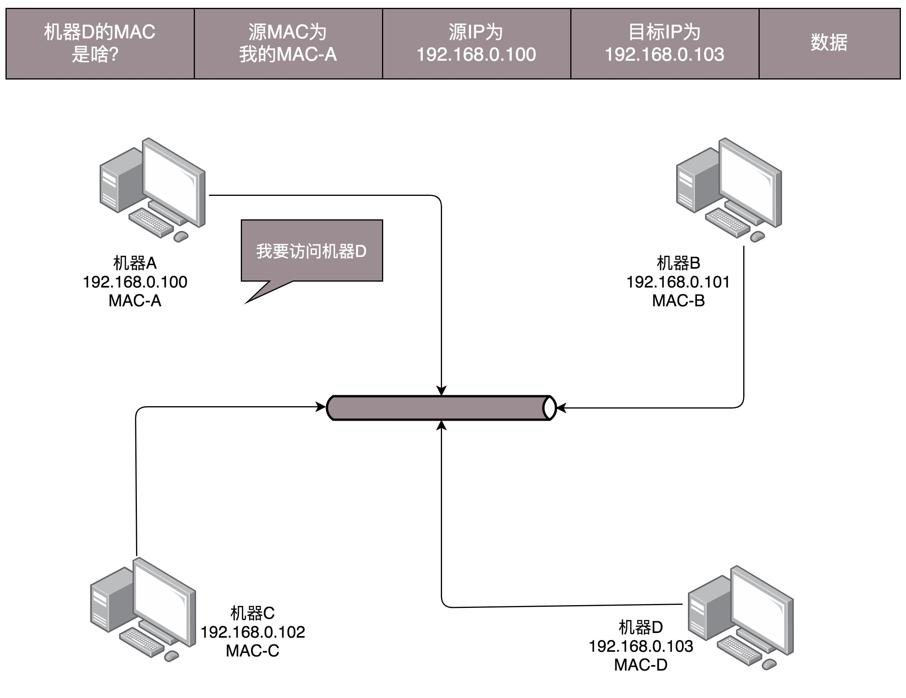
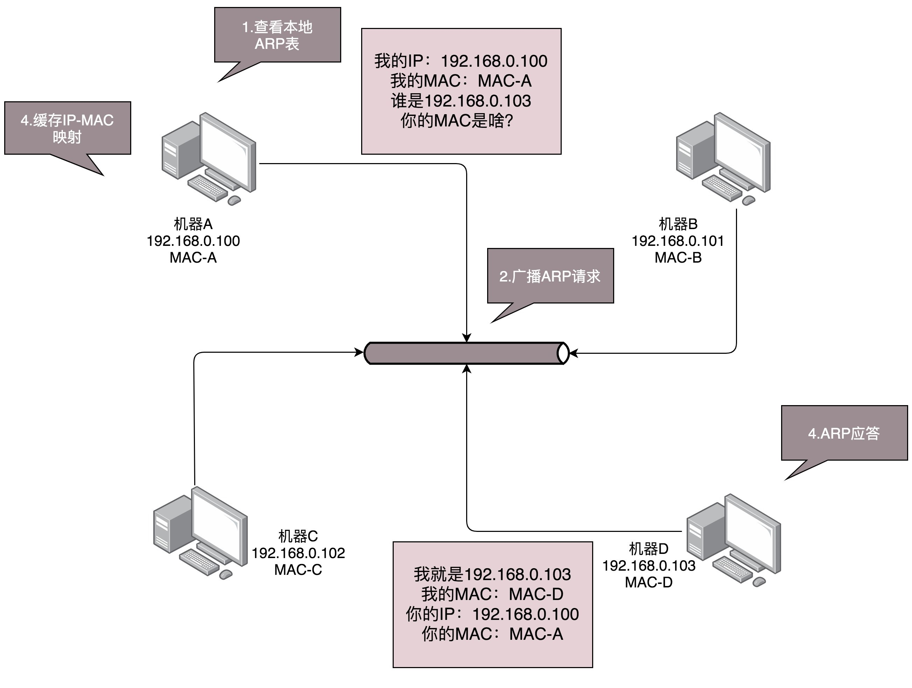
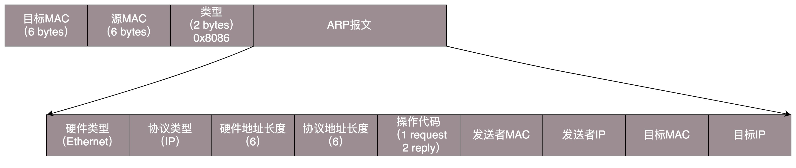
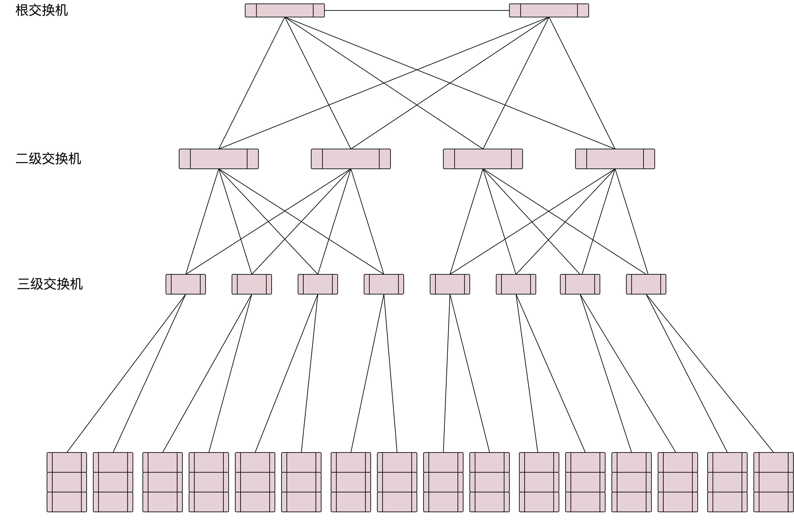
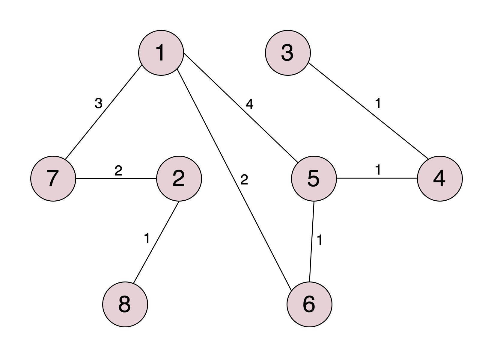
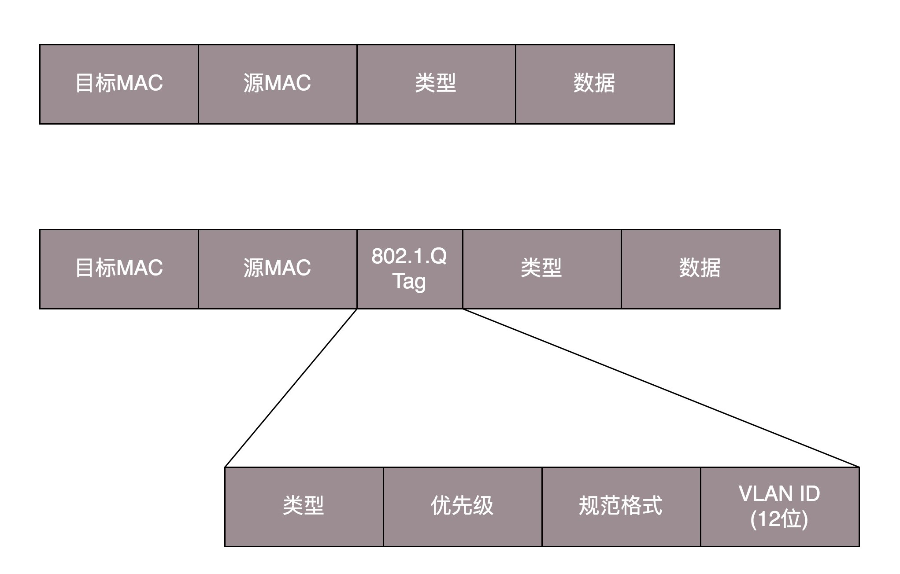
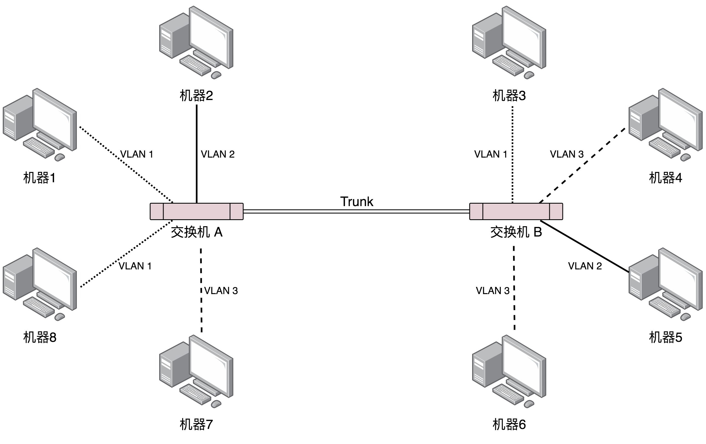

### 数据链路层 MAC层
MAC 层是用来解决多路访问的堵车问题的

MAC层相关内容：
[layer1物理层#集线器](layer1物理层.md "layer1物理层")

### ARP
ARP 协议，即已知 IP 地址求 MAC；

ARP 是通过**广播**（吼）的方式来寻找目标 MAC 地址的，发送一个广播包，谁是这个 IP 谁来回答。广播完之后记住一段时间，这个叫作缓存

### STP协议
在数据结构中，有一个方法叫做**最小生成树**。有环的我们常称为**图**。将图中的环破了，就生成了**树**。在计算机网络中，生成树的算法叫作 **STP，全称 Spanning Tree Protocol**。

STP 协议比较复杂，一开始很难看懂，但是其实这是一场血雨腥风的武林比武或者华山论剑，最终决出五岳盟主的方式。

在 STP 协议里面有很多概念，译名就非常拗口，但是我一作比喻，你很容易就明白了。

- **Root Bridge**，也就是**根交换机**。这个比较容易理解，可以比喻为“掌门”交换机，是某棵树的老大，是掌门，最大的大哥。

- **Designated Bridges**，有的翻译为**指定交换机**。这个比较难理解，可以想像成一个“小弟”，对于树来说，就是一棵树的树枝。所谓“指定”的意思是，我拜谁做大哥，其他交换机通过这个交换机到达根交换机，也就相当于拜这个交换机做了大哥。这里注意是树枝，不是叶子，因为叶子往往是主机。

- **Bridge Protocol Data Units （BPDU）** ，**网桥协议数据单元**。可以比喻为“相互比较实力”的协议。行走江湖，比的就是武功，拼的就是实力。当两个交换机碰见的时候，也就是相连的时候，就需要互相比一比内力了。BPDU 只有掌门能发，已经隶属于某个掌门的交换机只能传达掌门的指示。

- **Priority Vector**，**优先级向量**。可以比喻为实力 （值越小越牛）。实力是啥？就是一组 ID 数目，[Root Bridge ID, Root Path Cost, Bridge ID, and Port ID]。为什么这样设计呢？这是因为要看怎么来比实力。先看 Root Bridge ID。拿出老大的 ID 看看，发现掌门一样，那就是师兄弟；再比 Root Path Cost，也即我距离我的老大的距离，也就是拿和掌门关系比，看同一个门派内谁和老大关系铁；最后比 Bridge ID，比我自己的 ID，拿自己的本事比。

#### STP 的工作过程
接下来，我们来看 STP 的工作过程。

一开始，江湖纷争，异常混乱。大家都觉得自己是掌门，谁也不服谁。于是，所有的交换机都认为自己是掌门，每个网桥都被分配了一个 ID。这个 ID 里有管理员分配的优先级，当然网络管理员知道哪些交换机贵，哪些交换机好，就会给它们分配高的优先级。这种交换机生下来武功就很高，起步就是乔峰。

既然都是掌门，互相都连着网线，就互相发送 BPDU 来比功夫呗。这一比就发现，有人是岳不群，有人是封不平，赢的接着当掌门，输的就只好做小弟了。当掌门的还会继续发 BPDU，而输的人就没有机会了。它们只有在收到掌门发的 BPDU 的时候，转发一下，表示服从命令。

数字表示优先级。就像这个图，5 和 6 碰见了，6 的优先级低，所以乖乖做小弟。于是一个小门派形成，5 是掌门，6 是小弟。其他诸如 1-7、2-8、3-4 这样的小门派，也诞生了。于是江湖出现了很多小的门派，小的门派，接着合并。

合并的过程会出现以下四种情形，我分别来介绍。

##### 情形一：掌门遇到掌门
当 5 碰到了 1，掌门碰见掌门，1 觉得自己是掌门，5 也刚刚跟别人 PK 完成为掌门。这俩掌门比较功夫，最终 1 胜出。于是输掉的掌门 5 就会率领所有的小弟归顺。结果就是 1 成为大掌门。

##### 情形二：同门相遇
同门相遇可以是掌门与自己的小弟相遇，这说明存在“环”了。这个小弟已经通过其他门路拜在你门下，结果你还不认识，就 PK 了一把。结果掌门发现这个小弟功夫不错，不应该级别这么低，就把它招到门下亲自带，那这个小弟就相当于升职了。

我们再来看，假如 1 和 6 相遇。6 原来就拜在 1 的门下，只不过 6 的上司是 5，5 的上司是 1。1 发现，6 距离我才只有 2，比从 5 这里过来的 5（=4+1）近多了，那 6 就直接汇报给我吧。于是，5 和 6 分别汇报给 1。

同门相遇还可以是小弟相遇。这个时候就要比较谁和掌门的关系近，当然近的当大哥。刚才 5 和 6 同时汇报给 1 了，后来 5 和 6 在比较功夫的时候发现，5 你直接汇报给 1 距离是 4，如果 5 汇报给 6 再汇报给 1，距离只有 2+1=3，所以 5 干脆拜 6 为上司。

##### 情形三：掌门与其他帮派小弟相遇
小弟拿本帮掌门和这个掌门比较，赢了，这个掌门拜入门来。输了，会拜入新掌门，并且逐渐拉拢和自己连接的兄弟，一起弃暗投明。

例如，2 和 7 相遇，虽然 7 是小弟，2 是掌门。就个人武功而言，2 比 7 强，但是 7 的掌门是 1，比 2 牛，所以没办法，2 要拜入 7 的门派，并且连同自己的小弟都一起拜入。

##### 情形四：不同门小弟相遇
各自拿掌门比较，输了的拜入赢的门派，并且逐渐将与自己连接的兄弟弃暗投明。

例如，5 和 4 相遇。虽然 4 的武功好于 5，但是 5 的掌门是 1，比 4 牛，于是 4 拜入 5 的门派。后来当 3 和 4 相遇的时候，3 发现 4 已经叛变了，4 说我现在老大是 1，比你牛，要不你也来吧，于是 3 也拜入 1。

最终，生成一棵树，武林一统，天下太平。但是天下大势，分久必合，合久必分，天下统一久了，也会有相应的问题。

### VLAN
毕竟机器多了，交换机也多了，就算交换机比 Hub 智能一些，但是还是难免有广播的问题，一大波机器，相关的部门、不相关的部门，**广播一大堆，性能就下来了**。就像一家公司，创业的时候，一二十个人，坐在一个会议室，有事情大家讨论一下，非常方便。但是如果变成了 50 个人，全在一个会议室里面吵吵，就会乱得不得了。

你们公司有不同的部门，有的部门需要保密的，比如人事部门，肯定要讨论升职加薪的事儿。**由于在同一个广播域里面，很多包都会在一个局域网里面飘啊飘，碰到了一个会抓包的程序员，就能抓到这些包，如果没有加密，就能看到这些敏感信息了**。还是上面的例子，50 个人在一个会议室里面七嘴八舌地讨论，其中有两个 HR，那他们讨论的问题，肯定被其他人偷偷听走了。

那咋办，分部门，分会议室呗。那我们就来看看怎么分。

有两种分的方法，一个是**物理隔离**。每个部门设一个单独的会议室，对应到网络方面，就是每个部门有单独的交换机，配置单独的子网，这样部门之间的沟通就需要路由器了。路由器咱们还没讲到，以后再说。这样的问题在于，有的部门人多，有的部门人少。人少的部门慢慢人会变多，人多的部门也可能人越变越少。如果每个部门有单独的交换机，口多了浪费，少了又不够用。

另外一种方式是**虚拟隔离**，就是用我们常说的 **VLAN**，或者叫**虚拟局域网**。使用 VLAN，一个交换机上会连属于多个局域网的机器，那交换机怎么区分哪个机器属于哪个局域网呢？

我们只需要在原来的二层的头上加一个 TAG，里面有一个 VLAN ID，一共 12 位。为什么是 12 位呢？因为 12 位可以划分 4096 个 VLAN。这样是不是还不够啊。现在的情况证明，目前云计算厂商里面绝对不止 4096 个用户。当然每个用户需要一个 VLAN 了啊，怎么办呢，这个我们在后面的章节再说。

如果我们买的交换机是支持 VLAN 的，当这个交换机把二层的头取下来的时候，就能够识别这个 VLAN ID。这样只有相同 VLAN 的包，才会互相转发，不同 VLAN 的包，是看不到的。这样广播问题和安全问题就都能够解决了。

我们可以设置交换机每个口所属的 VLAN。如果某个口坐的是程序员，他们属于 VLAN 10；如果某个口坐的是人事，他们属于 VLAN 20；如果某个口坐的是财务，他们属于 VLAN 30。这样，财务发的包，交换机只会转发到 VLAN 30 的口上。程序员啊，你就监听 VLAN 10 吧，里面除了代码，啥都没有。

而且对于交换机来讲，每个 VLAN 的口都是可以重新设置的。一个财务走了，把他所在座位的口从 VLAN 30 移除掉，来了一个程序员，坐在财务的位置上，就把这个口设置为 VLAN 10，十分灵活。

有人会问交换机之间怎么连接呢？将两个交换机连接起来的口应该设置成什么 VLAN 呢？对于支持 VLAN 的交换机，有一种口叫作 **Trunk 口**。它可以转发属于任何 VLAN 的口。交换机之间可以通过这种口相互连接。

好了，解决这么多交换机连接在一起的问题，办公室的问题似乎搞定了。然而这只是一般复杂的场景，因为你能接触到的网络，到目前为止，不管是你的台式机，还是笔记本所连接的网络，对于带宽、高可用等都要求不高。就算出了问题，一会儿上不了网，也不会有什么大事。

我们在宿舍、学校或者办公室，经常会访问一些网站，这些网站似乎永远不会“挂掉”。那是因为这些网站都生活在一个叫做数据中心的地方，那里的网络世界更加复杂。
