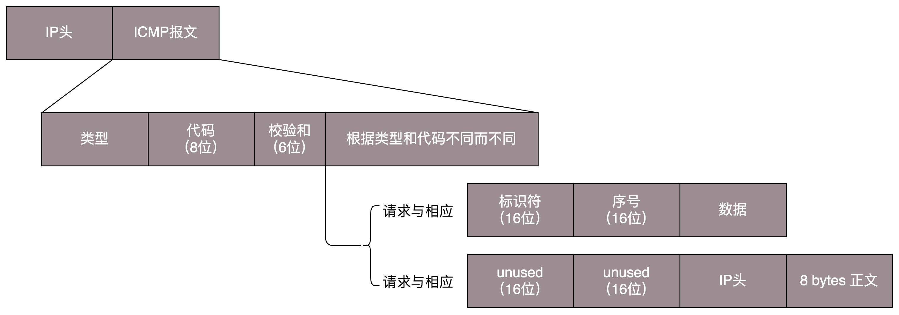

### IP
**网际协议**（**英语：Internet Protocol，缩写：IP**；也称互联网协议）是用于分组交换数据网络的一种协议。

IP是在TCP/IP协议族中网络层的主要协议，任务仅仅是根据源主机和目的主机的地址来传送数据。为此目的，IP定义了寻址方法和数据报的封装结构。第一个架构的主要版本为IPv4，目前仍然是广泛使用的互联网协议，尽管世界各地正在积极部署IPv6。

### ICMP
网络不通的情况下你会想到 ping 一下。那你知道 ping 是如何工作的吗？

ping 是基于 ICMP 协议工作的。**ICMP** 全称 **Internet Control Message Protocol**，就是**互联网控制报文协议**。这里面的关键词是“控制”，那具体是怎么控制的呢？

网络包在异常复杂的网络环境中传输时，常常会遇到各种各样的问题。当遇到问题的时候，总不能“死个不明不白”，要传出消息来，报告情况，这样才可以调整传输策略。这就相当于我们经常看到的电视剧里，古代行军的时候，为将为帅者需要通过侦察兵、哨探或传令兵等人肉的方式来掌握情况，控制整个战局。

ICMP 报文是封装在 IP 包里面的。因为传输指令的时候，肯定需要源地址和目标地址。它本身非常简单。因为作为侦查兵，要轻装上阵，不能携带大量的包袱。

ICMP 报文有很多的类型，不同的类型有不同的代码。**最常用的类型是主动请求为 8，主动请求的应答为 0**。

#### 查询报文类型
我们经常在电视剧里听到这样的话：主帅说，来人哪！前方战事如何，快去派人打探，一有情况，立即通报！

这种是主帅发起的，主动查看敌情，对应 ICMP 的**查询报文类型**。例如，常用的 **ping 就是查询报文，是一种主动请求，并且获得主动应答的 ICMP 协议**。所以，ping 发的包也是符合 ICMP 协议格式的，只不过它在后面增加了自己的格式。

对 ping 的主动请求，进行网络抓包，称为 **ICMP ECHO REQUEST**。**同理主动请求的回复，称为ICMP ECHO REPLY**。比起原生的 ICMP，这里面多了两个字段，一个是**标识符**。这个很好理解，你派出去两队侦查兵，一队是侦查战况的，一队是去查找水源的，要有个标识才能区分。另一个是**序号**，你派出去的侦查兵，都要编个号。如果派出去 10 个，回来 10 个，就说明前方战况不错；如果派出去 10 个，回来 2 个，说明情况可能不妙。

在选项数据中，ping 还会存放发送请求的时间值，来计算往返时间，说明路程的长短。

#### 差错报文类型
当然也有另外一种方式，就是差错报文。

主帅骑马走着走着，突然来了一匹快马，上面的小兵气喘吁吁的：报告主公，不好啦！张将军遭遇埋伏，全军覆没啦！这种是异常情况发起的，来报告发生了不好的事情，对应 ICMP 的**差错报文类型**。

我举几个 ICMP 差错报文的例子：终点不可达为 3，源抑制为 4，超时为 11，重定向为 5。这些都是什么意思呢？我给你具体解释一下。

**第一种是终点不可达**。小兵：报告主公，您让把粮草送到张将军那里，结果没有送到。

如果你是主公，你肯定会问，为啥送不到？具体的原因在代码中表示就是，网络不可达代码为 0，主机不可达代码为 1，协议不可达代码为 2，端口不可达代码为 3，需要进行分片但设置了不分片位代码为 4。

具体的场景就像这样：

- 网络不可达：主公，找不到地方呀？
- 主机不可达：主公，找到地方没这个人呀？
- 协议不可达：主公，找到地方，找到人，口号没对上，人家天王盖地虎，我说 12345！
- 端口不可达：主公，找到地方，找到人，对了口号，事儿没对上，我去送粮草，人家说他们在等救兵。
- 需要进行分片但设置了不分片位：主公，走到一半，山路狭窄，想换小车，但是您的将令，严禁换小车，就没办法送到了。

**第二种是源站抑制**，也就是让源站放慢发送速度。小兵：报告主公，您粮草送的太多了吃不完。

**第三种是时间超时**，也就是超过网络包的生存时间还是没到。小兵：报告主公，送粮草的人，自己把粮草吃完了，还没找到地方，已经饿死啦。

**第四种是路由重定向**，也就是让下次发给另一个路由器。小兵：报告主公，上次送粮草的人本来只要走一站地铁，非得从五环绕，下次别这样了啊。

差错报文的结构相对复杂一些。除了前面还是 IP，ICMP 的前 8 字节不变，后面则跟上出错的那个 IP 包的 IP 头和 IP 正文的前 8 个字节。

而且这类侦查兵特别恪尽职守，不但自己返回来报信，还把一部分遗物也带回来。

- 侦察兵：报告主公，张将军已经战死沙场，这是张将军的印信和佩剑。
- 主公：神马？张将军是怎么死的（可以查看 ICMP 的前 8 字节）？没错，这是张将军的剑，是他的剑（IP 数据包的头及正文前 8 字节）。

#### ping：查询报文类型的使用

接下来，我们重点来看 ping 的发送和接收过程。

假定主机 A 的 IP 地址是 192.168.1.1，主机 B 的 IP 地址是 192.168.1.2，它们都在同一个子网。那当你在主机 A 上运行“ping 192.168.1.2”后，会发生什么呢?

ping 命令执行的时候，源主机首先会构建一个 ICMP 请求数据包，ICMP 数据包内包含多个字段。最重要的是两个，第一个是**类型字段**，对于请求数据包而言该字段为 8；另外一个是**顺序号**，主要用于区分连续 ping 的时候发出的多个数据包。每发出一个请求数据包，顺序号会自动加 1。**为了能够计算往返时间 RTT，它会在报文的数据部分插入发送时间。**

然后，由 ICMP 协议将这个数据包连同地址 192.168.1.2 一起交给 IP 层。IP 层将以 192.168.1.2 作为目的地址，本机 IP 地址作为源地址，加上一些其他控制信息，构建一个 IP 数据包。

接下来，需要加入 MAC 头。如果在本节 ARP 映射表中查找出 IP 地址 192.168.1.2 所对应的 MAC 地址，则可以直接使用；如果没有，则需要发送 ARP 协议查询 MAC 地址，获得 MAC 地址后，由数据链路层构建一个数据帧，目的地址是 IP 层传过来的 MAC 地址，源地址则是本机的 MAC 地址；还要附加上一些控制信息，依据以太网的介质访问规则，将它们传送出去。

主机 B 收到这个数据帧后，先检查它的目的 MAC 地址，并和本机的 MAC 地址对比，如符合，则接收，否则就丢弃。接收后检查该数据帧，将 IP 数据包从帧中提取出来，交给本机的 IP 层。同样，IP 层检查后，将有用的信息提取后交给 ICMP 协议。

主机 B 会构建一个 ICMP 应答包，应答数据包的类型字段为 0，顺序号为接收到的请求数据包中的顺序号，然后再发送出去给主机 A。

在规定的时候间内，源主机如果没有接到 ICMP 的应答包，则说明目标主机不可达；如果接收到了 ICMP 应答包，则说明目标主机可达。此时，源主机会检查，用当前时刻减去该数据包最初从源主机上发出的时刻，就是 ICMP 数据包的时间延迟。

当然这只是最简单的，同一个局域网里面的情况。如果跨网段的话，还会涉及网关的转发、路由器的转发等等。但是对于 ICMP 的头来讲，是没什么影响的。会影响的是根据目标 IP 地址，选择路由的下一跳，还有每经过一个路由器到达一个新的局域网，需要换 MAC 头里面的 MAC 地址。

如果在自己的可控范围之内，当遇到网络不通的问题的时候，除了直接 ping 目标的 IP 地址之外，还应该有一个清晰的网络拓扑图。并且从理论上来讲，应该要清楚地知道一个网络包从源地址到目标地址都需要经过哪些设备，然后逐个 ping 中间的这些设备或者机器。如果可能的话，在这些关键点，通过 tcpdump -i eth0 icmp，查看包有没有到达某个点，回复的包到达了哪个点，可以更加容易推断出错的位置。

经常会遇到一个问题，如果不在我们的控制范围内，很多中间设备都是禁止 ping 的，但是 ping 不通不代表网络不通。这个时候就要使用 telnet，通过其他协议来测试网络是否通，这个就不在本篇的讲述范围了。

说了这么多，你应该可以看出 **ping 这个程序是使用了 ICMP 里面的 ECHO REQUEST 和 ECHO REPLY 类型的**。

#### Traceroute：差错报文类型的使用
那其他的类型呢？是不是只有真正遇到错误的时候，才能收到呢？那也不是，有一个程序 Traceroute，是个“大骗子”。它会使用 ICMP 的规则，故意制造一些能够产生错误的场景。

所以，**Traceroute 的第一个作用就是故意设置特殊的 TTL，来追踪去往目的地时沿途经过的路由器**。Traceroute 的参数指向某个目的 IP 地址，它会发送一个 UDP 的数据包。将 TTL 设置成 1，也就是说一旦遇到一个路由器或者一个关卡，就表示它“牺牲”了。

如果中间的路由器不止一个，当然碰到第一个就“牺牲”。于是，返回一个 ICMP 包，也就是网络差错包，类型是时间超时。那大军前行就带一顿饭，试一试走多远会被饿死，然后找个哨探回来报告，那我就知道大军只带一顿饭能走多远了。

接下来，将 TTL 设置为 2。第一关过了，第二关就“牺牲”了，那我就知道第二关有多远。如此反复，直到到达目的主机。这样，Traceroute 就拿到了所有的路由器 IP。当然，有的路由器压根不会回这个 ICMP。这也是 Traceroute 一个公网的地址，看不到中间路由的原因。

怎么知道 UDP 有没有到达目的主机呢？Traceroute 程序会发送一份 UDP 数据报给目的主机，但它会选择一个不可能的值作为 UDP 端口号（大于 30000）。当该数据报到达时，将使目的主机的 UDP 模块产生一份“端口不可达”错误 ICMP 报文。如果数据报没有到达，则可能是超时。

这就相当于故意派人去西天如来那里去请一本《道德经》，结果人家信佛不信道，消息就会被打出来。被打的消息传回来，你就知道西天是能够到达的。为什么不去取《心经》呢？因为 UDP 是无连接的。也就是说这人一派出去，你就得不到任何音信。你无法区别到底是半路走丢了，还是真的信佛遁入空门了，只有让人家打出来，你才会得到消息。

**Traceroute 还有一个作用是故意设置不分片，从而确定路径的 MTU**。要做的工作首先是发送分组，并设置“不分片”标志。发送的第一个分组的长度正好与出口 MTU 相等。如果中间遇到窄的关口会被卡住，会发送 ICMP 网络差错包，类型为“需要进行分片但设置了不分片位”。其实，这是人家故意的好吧，每次收到 ICMP“不能分片”差错时就减小分组的长度，直到到达目标主机。

### OSPF
**开放式最短路径优先**（英语：Open Shortest Path First，缩写为 OSPF）是**一种基于IP协议的路由协议**。它是大中型网络上使用较为广泛的IGP协议。OSPF是对**链路状态路由协议**的一种实现，运作于自治系统内部。OSPF分为OSPFv2和OSPFv3两个版本：OSPFv2定义于RFC 2328（1998），支持IPv4网络；而OSPFv3定义于RFC 5340（2008），支持IPv6网络。

它采用戴克斯特拉算法来计算最短路径树。它使用“代价（Cost）”作为路由度量。链路状态数据库（LSDB）用来保存当前网络拓扑结构，路由器上属于同一区域的链路状态数据库是相同的（属于多个区域的路由器会为每个区域维护一份链路状态数据库）。

OSPF提出了“区域（Area）”的概念，一个网络可以由单一区域或者多个区域组成。其中，一个特别的区域被称为骨干区域（Backbone Area），该区域是整个OSPF网络的核心区域，并且所有其他的区域都与之直接连接。所有的内部路由都通过骨干区域传递到其他非骨干区域。所有的区域都必须直接连接到骨干区域，如果不能创建直接连接，那么可以通过虚链路（virtual link）和骨干区域创建虚拟连接。

同一个广播域（Broadcast Domain）的路由器或者一个点对点（Point To Point）连接的两端的路由器，在发现彼此的时候，创建邻接（Adjacencies）[注 1]。多路访问网络以及非广播多路访问网络的路由器会选举指定路由器（Designated Router, DR）和备份指定路由器（Backup Designated Router, BDR），DR和BDR作为网络的中心负责路由器之间的信息交换从而降低了网络中的信息流量。OSPF协议同时使用单播（Unicast）和组播（Multicast）来发送Hello包和链路状态更新（Link State Updates），使用的组播地址为224.0.0.5和224.0.0.6。与RIP和BGP不同的是，OSPF协议不使用TCP或者UDP协议而是直接承载在IP协议之上，IP协议号为89。

#### OSPF相关资料
[OSPF维基百科](https://zh.wikipedia.org/wiki/%E5%BC%80%E6%94%BE%E5%BC%8F%E6%9C%80%E7%9F%AD%E8%B7%AF%E5%BE%84%E4%BC%98%E5%85%88 "OSPF维基百科")
[layer1物理层（各种网络设备）#基于链路状态路由算法的 OSPF](layer1物理层（各种网络设备）.md "基于链路状态路由算法的 OSPF")

### BGP
**边界网关协议**（英语：Border Gateway Protocol，缩写：BGP）是互联网上一个核心的去中心化自治路由协议。它通过维护IP路由表或‘前缀’表来实现自治系统（AS）之间的可达性，属于矢量路由协议。BGP不使用传统的内部网关协议（IGP）的指标，而使用基于路径、网络策略或规则集来决定路由。因此，它更适合被称为矢量性协议，而不是路由协议。

大多数互联网服务提供商必须使用BGP来与其他ISP建立路由连接（尤其是当它们采取多宿主连接时）。因此，即使大多数互联网用户不直接使用它，但是与7号信令系统相比，即通过PSTN的跨供应商核心响应设置协议，BGP仍然是互联网最重要的协议之一。特大型的私有IP网络也可以使用BGP。例如当需要将若干个大型的开放最短路径优先（OSPF）网络进行合并，而OSPF本身又无法提供这种可扩展性时。使用BGP的另一个原因是其能为多宿主的单个ISP（RFC 1998）或多个ISP网络提供更好的冗余网络。

#### BGP相关资料
[BGP维基百科](https://zh.wikipedia.org/wiki/%E8%BE%B9%E7%95%8C%E7%BD%91%E5%85%B3%E5%8D%8F%E8%AE%AE "BGP维基百科")
[layer1物理层（各种网络设备）#基于距离矢量路由算法的 BGP](layer1物理层（各种网络设备）.md "基于距离矢量路由算法的 BGP")
