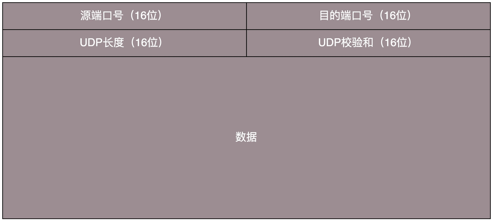
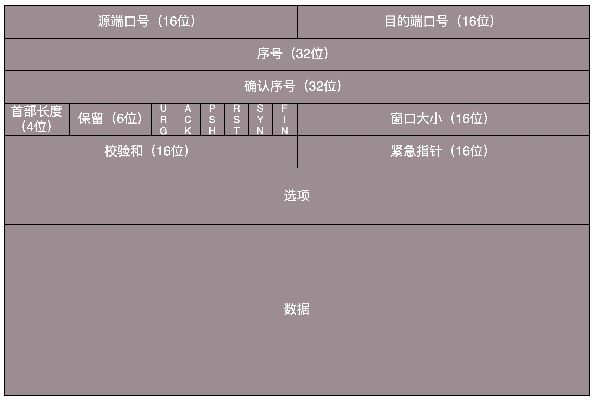
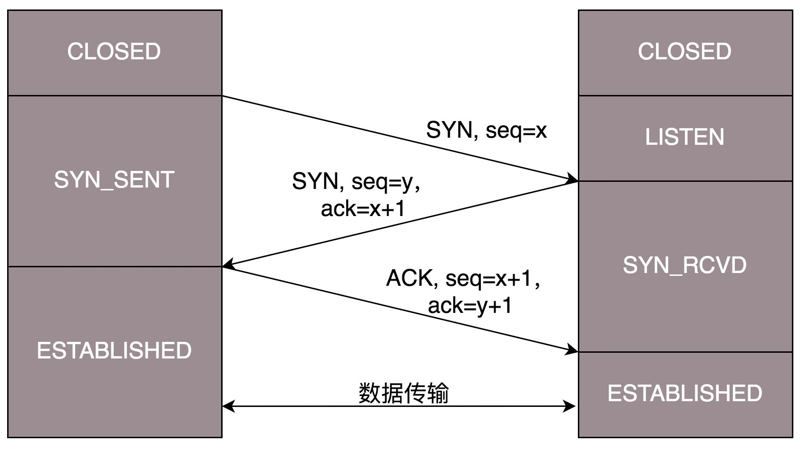
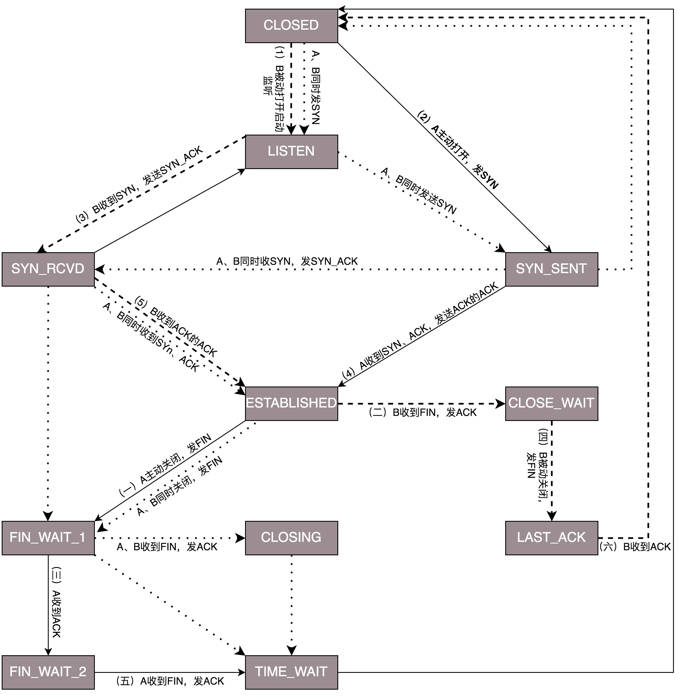
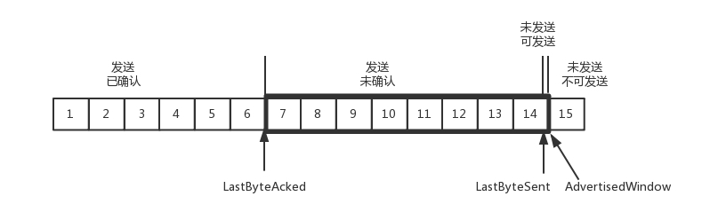
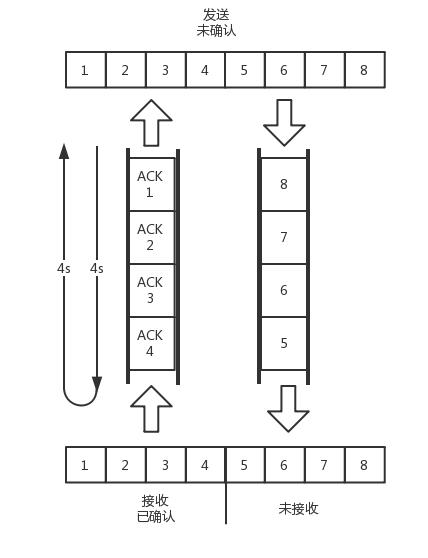

### UPD

我们可以这样比喻，如果 MAC 层定义了本地局域网的传输行为，IP 层定义了整个网络端到端的传输行为，这两层基本定义了这样的基因：**网络传输是以包为单位的**，二层叫帧，网络层叫包，传输层叫段。我们笼统地称为包。包单独传输，自行选路，在不同的设备封装解封装，不保证到达。基于这个基因，生下来的孩子 UDP 完全继承了这些特性，几乎没有自己的思想。

当我发送的 UDP 包到达目标机器后，发现 MAC 地址匹配，于是就取下来，将剩下的包传给处理 IP 层的代码。把 IP 头取下来，发现目标 IP 匹配，接下来呢？这里面的数据包是给谁呢？

发送的时候，我知道我发的是一个 UDP 的包，收到的那台机器咋知道的呢？所以在 IP 头里面有个 8 位协议，这里会存放，数据里面到底是 TCP 还是 UDP，当然这里是 UDP。于是，如果我们知道 UDP 头的格式，就能从数据里面，将它解析出来。解析出来以后呢？数据给谁处理呢？

处理完传输层的事情，内核的事情基本就干完了，里面的数据应该交给应用程序自己去处理，可是一台机器上跑着这么多的应用程序，应该给谁呢？

无论应用程序写的使用 TCP 传数据，还是 UDP 传数据，都要监听一个端口。正是这个端口，用来区分应用程序，要不说端口不能冲突呢。两个应用监听一个端口，到时候包给谁呀？所以，按理说，无论是 TCP 还是 UDP 包头里面应该有端口号，根据端口号，将数据交给相应的应用程序。



当我们看到 UDP 包头的时候，发现的确有端口号，有源端口号和目标端口号。因为是两端通信嘛，这很好理解。但是你还会发现，UDP 除了端口号，再没有其他的了。

#### UDP的特点
1. 协议简单，不需要大量的数据结构、处理逻辑、包头字段
2. 它不会建立连接，虽然有端口号，但是监听在这个地方，谁都可以传给他数据，他也可以传给任何人数据，甚至可以同时传给多个人数据
3. 不会根据网络的情况进行发包的拥塞控制，无论网络丢包丢成啥样了，它该怎么发还怎么发。

#### UDP 的三大使用场景
**第一，需要资源少，在网络情况比较好的内网，或者对于丢包不敏感的应用**

DHCP 就是基于 UDP 协议的。一般的获取 IP 地址都是内网请求，而且一次获取不到 IP 又没事，过一会儿还有机会。我们讲过 PXE 可以在启动的时候自动安装操作系统，操作系统镜像的下载使用的 TFTP，这个也是基于 UDP 协议的。在还没有操作系统的时候，客户端拥有的资源很少，不适合维护一个复杂的状态机，而且因为是内网，一般也没啥问题。

**第二，不需要一对一沟通，建立连接，而是可以广播的应用**

UDP 的不面向连接的功能，可以使得可以承载广播或者多播的协议。DHCP 就是一种广播的形式，就是基于 UDP 协议的，而广播包的格式前面说过了。

对于多播，我们在讲 IP 地址的时候，讲过一个 D 类地址，也即组播地址，使用这个地址，可以将包组播给一批机器。当一台机器上的某个进程想监听某个组播地址的时候，需要发送 IGMP 包，所在网络的路由器就能收到这个包，知道有个机器上有个进程在监听这个组播地址。当路由器收到这个组播地址的时候，会将包转发给这台机器，这样就实现了跨路由器的组播。

有一个协议 VXLAN，也是需要用到组播，也是基于 UDP 协议的。

**第三，需要处理速度快，时延低，可以容忍少数丢包，但是要求即便网络拥塞，也毫不退缩，一往无前的时候**

UDP 简单、处理速度快，不像 TCP 那样，操这么多的心，各种重传啊，保证顺序啊，前面的不收到，后面的没法处理啊。不然等这些事情做完了，时延早就上去了。而 TCP 在网络不好出现丢包的时候，拥塞控制策略会主动的退缩，降低发送速度，这就相当于本来环境就差，还自断臂膀，用户本来就卡，这下更卡了。

当前很多应用都是要求低时延的，它们可不想用 TCP 如此复杂的机制，而是想根据自己的场景，实现自己的可靠和连接保证。例如，如果应用自己觉得，有的包丢了就丢了，没必要重传了，就可以算了，有的比较重要，则应用自己重传，而不依赖于 TCP。有的前面的包没到，后面的包到了，那就先给客户展示后面的嘛，干嘛非得等到齐了呢？如果网络不好，丢了包，那不能退缩啊，要尽快传啊，速度不能降下来啊，要挤占带宽，抢在客户失去耐心之前到达。

#### 基于UDP 的协议及使用场景
##### QUIC 网页或者 APP 的访问
原来访问网页和手机 APP 都是基于 HTTP 协议的。HTTP 协议是基于 TCP 的，建立连接都需要多次交互，对于时延比较大的目前主流的移动互联网来讲，建立一次连接需要的时间会比较长，然而既然是移动中，TCP 可能还会断了重连，也是很耗时的。而且目前的 HTTP 协议，往往采取多个数据通道共享一个连接的情况，这样本来为了加快传输速度，但是 TCP 的严格顺序策略使得哪怕共享通道，前一个不来，后一个和前一个即便没关系，也要等着，时延也会加大。

而 **QUIC**（全称 **Quick UDP Internet Connections，快速 UDP 互联网连接**）是 Google 提出的一种基于 UDP 改进的通信协议，其目的是降低网络通信的延迟，提供更好的用户互动体验。

QUIC 在应用层上，会自己实现快速连接建立、减少重传时延，自适应拥塞控制，是应用层“城会玩”的代表。

##### RTMP 流媒体的协议
现在直播比较火，直播协议多使用 RTMP，这个协议我们后面的章节也会讲，而这个 RTMP 协议也是基于 TCP 的。TCP 的严格顺序传输要保证前一个收到了，下一个才能确认，如果前一个收不到，下一个就算包已经收到了，在缓存里面，也需要等着。对于直播来讲，这显然是不合适的，因为老的视频帧丢了其实也就丢了，就算再传过来用户也不在意了，他们要看新的了，如果老是没来就等着，卡顿了，新的也看不了，那就会丢失客户，所以直播，实时性比较比较重要，宁可丢包，也不要卡顿的。

另外，对于丢包，其实对于视频播放来讲，有的包可以丢，有的包不能丢，因为视频的连续帧里面，有的帧重要，有的不重要，如果必须要丢包，隔几个帧丢一个，其实看视频的人不会感知，但是如果连续丢帧，就会感知了，因而在网络不好的情况下，应用希望选择性的丢帧。

还有就是当网络不好的时候，TCP 协议会主动降低发送速度，这对本来当时就卡的看视频来讲是要命的，应该应用层马上重传，而不是主动让步。因而，很多直播应用，都基于 UDP 实现了自己的视频传输协议。

##### 实时游戏
游戏有一个特点，就是实时性比较高。快一秒你干掉别人，慢一秒你被别人爆头，所以很多职业玩家会买非常专业的鼠标和键盘，争分夺秒。

因而，实时游戏中客户端和服务端要建立长连接，来保证实时传输。但是游戏玩家很多，服务器却不多。由于维护 TCP 连接需要在内核维护一些数据结构，因而一台机器能够支撑的 TCP 连接数目是有限的，然后 UDP 由于是没有连接的，在异步 IO 机制引入之前，常常是应对海量客户端连接的策略。

另外还是 TCP 的强顺序问题，对战的游戏，对网络的要求很简单，玩家通过客户端发送给服务器鼠标和键盘行走的位置，服务器会处理每个用户发送过来的所有场景，处理完再返回给客户端，客户端解析响应，渲染最新的场景展示给玩家。

如果出现一个数据包丢失，所有事情都需要停下来等待这个数据包重发。客户端会出现等待接收数据，然而玩家并不关心过期的数据，激战中卡 1 秒，等能动了都已经死了。

游戏对实时要求较为严格的情况下，采用自定义的可靠 UDP 协议，自定义重传策略，能够把丢包产生的延迟降到最低，尽量减少网络问题对游戏性造成的影响。

##### IoT 物联网
一方面，物联网领域终端资源少，很可能只是个内存非常小的嵌入式系统，而维护 TCP 协议代价太大；另一方面，物联网对实时性要求也很高，而 TCP 还是因为上面的那些原因导致时延大。Google 旗下的 Nest 建立 Thread Group，推出了物联网通信协议 Thread，就是基于 UDP 协议的。

##### 移动通信领域
在 4G 网络里，移动流量上网的数据面对的协议 GTP-U 是基于 UDP 的。因为移动网络协议比较复杂，而 GTP 协议本身就包含复杂的手机上线下线的通信协议。如果基于 TCP，TCP 的机制就显得非常多余

### TCP和UDP的区别
问这两个协议的区别，大部分人会回答，TCP 是面向连接的，UDP 是面向无连接的。

什么叫面向连接，什么叫无连接呢？在互通之前，面向连接的协议会先建立连接。例如，TCP 会三次握手，而 UDP 不会。为什么要建立连接呢？你 TCP 三次握手，我 UDP 也可以发三个包玩玩，有什么区别吗？

所谓的建立连接，是为了在客户端和服务端维护连接，而**建立一定的数据结构来维护双方交互的状态，用这样的数据结构来保证所谓的面向连接的特性**。

**TCP 提供可靠交付**。而 **UDP 继承了 IP 包的特性，不保证不丢失，不保证按顺序到达**。

**TCP 是面向字节流的**。发送的时候发的是一个流，没头没尾。IP 包可不是一个流，而是一个个的 IP 包。之所以变成了流，这也是 TCP 自己的状态维护做的事情。而 **UDP 继承了 IP 的特性，基于数据报的，一个一个地发，一个一个地收**。

**TCP 是可以有拥塞控制的**。它意识到包丢弃了或者网络的环境不好了，就会根据情况调整自己的行为，看看是不是发快了，要不要发慢点。**UDP 就不会，应用让我发，我就发，管它洪水滔天**。

因而 **TCP 其实是一个有状态服务**，通俗地讲就是有脑子的，里面精确地记着发送了没有，接收到没有，发送到哪个了，应该接收哪个了，错一点儿都不行。而 **UDP 则是无状态服务**。通俗地说是没脑子的，天真无邪的，发出去就发出去了。

### TCP
#### TCP 包头格式
我们先来看 TCP 头的格式。从这个图上可以看出，它比 UDP 复杂得多。



首先，**源端口号和目标端口号**是不可少的，这一点和 UDP 是一样的。如果没有这两个端口号。数据就不知道应该发给哪个应用。

接下来是**包的序号**。为什么要给包编号呢？当然是为了解决乱序的问题。不编好号怎么确认哪个应该先来，哪个应该后到呢。编号是为了解决乱序问题。既然是社会老司机，做事当然要稳重，一件件来，面临再复杂的情况，也临危不乱。

还应该有的就是**确认序号**。发出去的包应该有确认，要不然我怎么知道对方有没有收到呢？如果没有收到就应该重新发送，直到送达。这个可以解决不丢包的问题。作为老司机，做事当然要靠谱，答应了就要做到，暂时做不到也要有个回复。

TCP 是靠谱的协议，但是这不能说明它面临的网络环境好。从 IP 层面来讲，如果网络状况的确那么差，是没有任何可靠性保证的，而作为 IP 的上一层 TCP 也无能为力，唯一能做的就是更加努力，不断重传，通过各种算法保证。也就是说，对于 TCP 来讲，IP 层你丢不丢包，我管不着，但是我在我的层面上，会努力保证可靠性。

接下来有一些**状态位**。例如 SYN 是发起一个连接，ACK 是回复，RST 是重新连接，FIN 是结束连接等。TCP 是面向连接的，因而双方要维护连接的状态，这些带状态位的包的发送，会引起双方的状态变更。

还有一个重要的就是**窗口大小**。TCP 要做流量控制，通信双方各声明一个窗口，标识自己当前能够的处理能力，别发送的太快，撑死我，也别发的太慢，饿死我。

作为老司机，做事情要有分寸，待人要把握尺度，既能适当提出自己的要求，又不强人所难。除了做流量控制以外，TCP 还会做拥塞控制，对于真正的通路堵车不堵车，它无能为力，唯一能做的就是控制自己，也即控制发送的速度。不能改变世界，就改变自己嘛。

通过对 TCP 头的解析，我们知道要掌握 TCP 协议，重点应该关注以下几个问题：

- **顺序问题** ，稳重不乱；
- **丢包问题**，承诺靠谱；
- **连接维护**，有始有终；
- **流量控制**，把握分寸；
- **拥塞控制**，知进知退。

#### 连接维护 TCP 的三次握手
所有的问题，首先都要先建立一个连接，所以我们先来看连接维护问题。

TCP 的连接建立，我们常常称为三次握手。

```
A：您好，我是 A。
B：您好 A，我是 B。
A：您好 B。
```

我们也常称为“请求 -> 应答 -> 应答之应答”的三个回合。这个看起来简单，其实里面还是有很多的学问，很多的细节。

首先，为什么要三次，而不是两次？按说两个人打招呼，一来一回就可以了啊？为了可靠，为什么不是四次？

答：
```
1.只要双方的消息都有去有回，就基本可以了
2.三次握手除了双方建立连接外，主要还是为了沟通一件事情，就是 TCP 包的序号的问题
```

我们还是假设这个通路是非常不可靠的，A 要发起一个连接，当发了第一个请求杳无音信的时候，会有很多的可能性，比如第一个请求包丢了，再如没有丢，但是绕了弯路，超时了，还有 B 没有响应，不想和我连接。

A 不能确认结果，于是再发，再发。终于，有一个请求包到了 B，但是请求包到了 B 的这个事情，目前 A 还是不知道的，A 还有可能再发。

B 收到了请求包，就知道了 A 的存在，并且知道 A 要和它建立连接。如果 B 不乐意建立连接，则 A 会重试一阵后放弃，连接建立失败，没有问题；如果 B 是乐意建立连接的，则会发送应答包给 A。

当然对于 B 来说，这个应答包也是一入网络深似海，不知道能不能到达 A。这个时候 B 自然不能认为连接是建立好了，因为应答包仍然会丢，会绕弯路，或者 A 已经挂了都有可能。

而且这个时候 B 还能碰到一个诡异的现象就是，A 和 B 原来建立了连接，做了简单通信后，结束了连接。还记得吗？A 建立连接的时候，请求包重复发了几次，有的请求包绕了一大圈又回来了，B 会认为这也是一个正常的的请求的话，因此建立了连接，可以想象，这个连接不会进行下去，也没有个终结的时候，纯属单相思了。因而两次握手肯定不行。

B 发送的应答可能会发送多次，但是只要一次到达 A，A 就认为连接已经建立了，因为对于 A 来讲，他的消息有去有回。A 会给 B 发送应答之应答，而 B 也在等这个消息，才能确认连接的建立，*只有等到了这个消息，对于 B 来讲，才算它的消息有去有回*。

当然 A 发给 B 的应答之应答也会丢，也会绕路，甚至 B 挂了。按理来说，还应该有个应答之应答之应答，这样下去就没底了。所以四次握手是可以的，四十次都可以，关键四百次也不能保证就真的可靠了。**只要双方的消息都有去有回，就基本可以了**。

好在大部分情况下，A 和 B 建立了连接之后，A 会马上发送数据的，**一旦 A 发送数据，则很多问题都得到了解决。例如 A 发给 B 的应答丢了，当 A 后续发送的数据到达的时候，B 可以认为这个连接已经建立，或者 B 压根就挂了，A 发送的数据，会报错，说 B 不可达，A 就知道 B 出事情了。**

当然你可以说 A 比较坏，就是不发数据，建立连接后空着。我们在程序设计的时候，可以要求开启 keepalive 机制，即使没有真实的数据包，也有探活包。

另外，你作为服务端 B 的程序设计者，对于 A 这种长时间不发包的客户端，可以主动关闭，从而空出资源来给其他客户端使用。

**三次握手除了双方建立连接外，主要还是为了沟通一件事情，就是 TCP 包的序号的问题**。

A 要告诉 B，我这面发起的包的序号起始是从哪个号开始的，B 同样也要告诉 A，B 发起的包的序号起始是从哪个号开始的。为什么序号不能都从 1 开始呢？因为这样往往会出现冲突。

例如，A 连上 B 之后，发送了 1、2、3 三个包，但是发送 3 的时候，中间丢了，或者绕路了，于是重新发送，后来 A 掉线了，重新连上 B 后，序号又从 1 开始，然后发送 2，但是压根没想发送 3，但是上次绕路的那个 3 又回来了，发给了 B，B 自然认为，这就是下一个包，于是发生了错误。

因而，每个连接都要有不同的序号。这个序号的起始序号是随着时间变化的，可以看成一个 32 位的计数器，每 4ms 加一，如果计算一下，如果到重复，需要 4 个多小时，那个绕路的包早就死翘翘了，因为我们都知道 IP 包头里面有个 TTL，也即生存时间。

好了，双方终于建立了信任，建立了连接。前面也说过，为了维护这个连接，双方都要维护一个状态机，在连接建立的过程中，双方的状态变化时序图就像这样。



一开始，客户端和服务端都处于 CLOSED 状态。先是服务端主动监听某个端口，处于 LISTEN 状态。然后客户端主动发起连接 SYN，之后处于 SYN-SENT 状态。服务端收到发起的连接，返回 SYN，并且 ACK 客户端的 SYN，之后处于 SYN-RCVD 状态。客户端收到服务端发送的 SYN 和 ACK 之后，发送 ACK 的 ACK，之后处于 ESTABLISHED 状态，因为它一发一收成功了。服务端收到 ACK 的 ACK 之后，处于 ESTABLISHED 状态，因为它也一发一收了。

#### 连接维护 TCP 四次挥手
好了，说完了连接，接下来说一说“拜拜”，好说好散。这常被称为四次挥手。

为什么要四次挥手呢？
答：
```
保证双方都能够处理完断开连接前的操作
```

```
A：B 啊，我不想玩了。
B：哦，你不想玩了啊，我知道了。
```

这个时候，还只是 A 不想玩了，也即 A 不会再发送数据，但是 B 能不能在 ACK 的时候，直接关闭呢？当然不可以了，很有可能 A 是发完了最后的数据就准备不玩了，但是 B 还没做完自己的事情，还是可以发送数据的，所以称为半关闭的状态。

这个时候 A 可以选择不再接收数据了，也可以选择最后再接收一段数据，等待 B 也主动关闭。

```
B：A 啊，好吧，我也不玩了，拜拜。
A：好的，拜拜。
```

这样整个连接就关闭了。但是这个过程有没有异常情况呢？当然有，上面是和平分手的场面。

A 开始说“不玩了”，B 说“知道了”，这个回合，是没什么问题的，因为在此之前，双方还处于合作的状态，如果 A 说“不玩了”，没有收到回复，则 A 会重新发送“不玩了”。但是这个回合结束之后，就有可能出现异常情况了，因为已经有一方率先撕破脸。

一种情况是，A 说完“不玩了”之后，直接跑路，是会有问题的，因为 B 还没有发起结束，而如果 A 跑路，B 就算发起结束，也得不到回答，B 就不知道该怎么办了。另一种情况是，A 说完“不玩了”，B 直接跑路，也是有问题的，因为 A 不知道 B 是还有事情要处理，还是过一会儿会发送结束。

那怎么解决这些问题呢？TCP 协议专门设计了几个状态来处理这些问题。我们来看断开连接的时候的**状态时序图**。


断开的时候，我们可以看到，当 A 说“不玩了”，就进入 FIN_WAIT_1 的状态，B 收到“A 不玩”的消息后，发送知道了，就进入 CLOSE_WAIT 的状态。

A 收到“B 说知道了”，就进入 FIN_WAIT_2 的状态，如果这个时候 B 直接跑路，则 A 将永远在这个状态。TCP 协议里面并没有对这个状态的处理，但是 Linux 有，可以调整 tcp_fin_timeout 这个参数，设置一个超时时间。

如果 B 没有跑路，发送了“B 也不玩了”的请求到达 A 时，A 发送“知道 B 也不玩了”的 ACK 后，从 FIN_WAIT_2 状态结束，按说 A 可以跑路了，但是最后的这个 ACK 万一 B 收不到呢？则 B 会重新发一个“B 不玩了”，这个时候 A 已经跑路了的话，B 就再也收不到 ACK 了，因而 TCP 协议要求 A 最后等待一段时间 TIME_WAIT，这个时间要足够长，长到如果 B 没收到 ACK 的话，“B 说不玩了”会重发的，A 会重新发一个 ACK 并且足够时间到达 B。

A 直接跑路还有一个问题是，A 的端口就直接空出来了，但是 B 不知道，B 原来发过的很多包很可能还在路上，如果 A 的端口被一个新的应用占用了，这个新的应用会收到上个连接中 B 发过来的包，虽然序列号是重新生成的，但是这里要上一个双保险，防止产生混乱，因而也需要等足够长的时间，等到原来 B 发送的所有的包都死翘翘，再空出端口来。

等待的时间设为 2MSL，**MSL** 是 **Maximum Segment Lifetime**，**报文最大生存时间**，它是任何报文在网络上存在的最长时间，超过这个时间报文将被丢弃。因为 TCP 报文基于是 IP 协议的，而 IP 头中有一个 TTL 域，是 IP 数据报可以经过的最大路由数，每经过一个处理他的路由器此值就减 1，当此值为 0 则数据报将被丢弃，同时发送 ICMP 报文通知源主机。协议规定 MSL 为 2 分钟，实际应用中常用的是 30 秒，1 分钟和 2 分钟等。

还有一个异常情况就是，B 超过了 2MSL 的时间，依然没有收到它发的 FIN 的 ACK，怎么办呢？按照 TCP 的原理，B 当然还会重发 FIN，这个时候 A 再收到这个包之后，A 就表示，我已经在这里等了这么长时间了，已经仁至义尽了，之后的我就都不认了，于是就直接发送 RST，B 就知道 A 早就跑了。

#### TCP 状态机
将连接建立和连接断开的两个时序状态图综合起来，就是这个著名的 TCP 的状态机。学习的时候比较建议将这个状态机和时序状态机对照着看，不然容易晕。



在这个图中，加黑加粗的部分，是上面说到的主要流程，其中阿拉伯数字的序号，是连接过程中的顺序，而大写中文数字的序号，是连接断开过程中的顺序。加粗的实线是客户端 A 的状态变迁，加粗的虚线是服务端 B 的状态变迁。

#### 如何实现一个靠谱的协议？
TCP为了保证顺序性，每一个包都有一个 ID。在建立连接的时候，会商定起始的 ID 是什么，然后按照 ID 一个个发送。为了保证不丢包，对于发送的包都要进行应答，但是这个应答也不是一个一个来的，而是会应答某个之前的 ID，表示都收到了，这种模式称为**累计确认**或者**累计应答**（**cumulative acknowledgment**）。

为了记录所有发送的包和接收的包，TCP 也需要发送端和接收端分别都有缓存来保存这些记录。发送端的缓存里是按照包的 ID 一个个排列，根据处理的情况分成四个部分。

##### 发送端的缓存部分
- **第一部分：发送了并且已经确认的**。这部分就是你交代下属的，并且也做完了的，应该划掉的。
- **第二部分：发送了并且尚未确认的**。这部分是你交代下属的，但是还没做完的，需要等待做完的回复之后，才能划掉。
- **第三部分：没有发送，但是已经等待发送的**。这部分是你还没有交代给下属，但是马上就要交代的。
- **第四部分：没有发送，并且暂时还不会发送的**。这部分是你还没有交代给下属，而且暂时还不会交代给下属的。

这里面为什么要区分第三部分和第四部分呢？没交代的，一下子全交代了不就完了吗？

在 TCP 里，接收端会给发送端报一个窗口的大小，叫 **Advertised window**。这个窗口的大小应该等于上面的第二部分加上第三部分，就是已经交代了没做完的加上马上要交代的。超过这个窗口的，接收端做不过来，就不能发送了。

于是，发送端需要保持下面的数据结构。


- **LastByteAcked**：第一部分和第二部分的分界线
- **LastByteSent**：第二部分和第三部分的分界线
- **LastByteAcked + AdvertisedWindow**：第三部分和第四部分的分界线

##### 接收端缓存部分

对于接收端来讲，它的缓存里记录的内容要简单一些。

- **第一部分：接受并且确认过的**。也就是我领导交代给我，并且我做完的。
- **第二部分：还没接收，但是马上就能接收的**。也即是我自己的能够接受的最大工作量。
- **第三部分：还没接收，也没法接收的**。也即超过工作量的部分，实在做不完。

对应的数据结构就像这样。


- **MaxRcvBuffer**：最大缓存的量；
- **LastByteRead** 之后是已经接收了，但是还没被应用层读取的；
- **NextByteExpected** 是第一部分和第二部分的分界线。第二部分的窗口有多大呢？

第二部分的窗口有多大呢？

NextByteExpected 和 LastByteRead 的差其实是还没被应用层读取的部分占用掉的 MaxRcvBuffer 的量，我们定义为 A。

AdvertisedWindow 其实是 MaxRcvBuffer 减去 A。

也就是：AdvertisedWindow=MaxRcvBuffer-((NextByteExpected-1)-LastByteRead)。

那第二部分和第三部分的分界线在哪里呢？NextByteExpected 加 AdvertisedWindow 就是第二部分和第三部分的分界线，其实也就是 LastByteRead 加上 MaxRcvBuffer。

其中**第二部分里面，由于受到的包可能不是顺序的，会出现空档，只有和第一部分连续的，可以马上进行回复，中间空着的部分需要等待，哪怕后面的已经来了**。

#### 顺序问题与丢包问题
接下来我们结合一个例子来看。

还是刚才的图，在发送端来看，1、2、3 已经发送并确认；4、5、6、7、8、9 都是发送了还没确认；10、11、12 是还没发出的；13、14、15 是接收方没有空间，不准备发的。

在接收端来看，1、2、3、4、5 是已经完成 ACK，但是没读取的；6、7 是等待接收的；8、9 是已经接收，但是没有 ACK 的。

发送端和接收端当前的状态如下：

- 1、2、3 没有问题，双方达成了一致。
- 4、5 接收方说 ACK 了，但是发送方还没收到，有可能丢了，有可能在路上。
- 6、7、8、9 肯定都发了，但是 8、9 已经到了，但是 6、7 没到，出现了乱序，缓存着但是没办法 ACK。

##### 确认与重发的机制
根据这个例子，我们可以知道，顺序问题和丢包问题都有可能发生，所以我们先来看**确认与重发的机制**。

假设 4 的确认到了，不幸的是，5 的 ACK 丢了，6、7 的数据包丢了，这该怎么办呢？

一种方法就是**超时重试**，也即对每一个发送了，但是没有 ACK 的包，都有设一个定时器，超过了一定的时间，就重新尝试。但是这个超时的时间如何评估呢？这个时间不宜过短，时间必须大于往返时间 RTT，否则会引起不必要的重传。也不宜过长，这样超时时间变长，访问就变慢了。

估计往返时间，需要 TCP 通过采样 RTT 的时间，然后进行加权平均，算出一个值，而且这个值还是要不断变化的，因为网络状况不断地变化。除了采样 RTT，还要采样 RTT 的波动范围，计算出一个估计的超时时间。由于重传时间是不断变化的，我们称为**自适应重传算法**（**Adaptive Retransmission Algorithm**）。

如果过一段时间，5、6、7 都超时了，就会重新发送。接收方发现 5 原来接收过，于是丢弃 5；6 收到了，发送 ACK，要求下一个是 7，7 不幸又丢了。当 7 再次超时的时候，有需要重传的时候，TCP 的策略是**超时间隔加倍**。**每当遇到一次超时重传的时候，都会将下一次超时时间间隔设为先前值的两倍。两次超时，就说明网络环境差，不宜频繁反复发送**。

超时触发重传存在的问题是，超时周期可能相对较长。那是不是可以有更快的方式呢？

##### 快速重传
有一个可以快速重传的机制，**当接收方收到一个序号大于下一个所期望的报文段时，就会检测到数据流中的一个间隔，于是它就会发送冗余的 ACK，仍然 ACK 的是期望接收的报文段。而当客户端收到三个冗余的 ACK 后，就会在定时器过期之前，重传丢失的报文段**。

例如，接收方发现 6 收到了，8 也收到了，但是 7 还没来，那肯定是丢了，于是发送 6 的 ACK，要求下一个是 7。接下来，收到后续的包，仍然发送 6 的 ACK，要求下一个是 7。当客户端收到 3 个重复 ACK，就会发现 7 的确丢了，不等超时，马上重发。

##### SACK
还有一种方式称为 **Selective Acknowledgment** （**SACK**）。这种方式需要在 TCP 头里加一个 SACK 的东西，可以将缓存的地图发送给发送方。例如可以发送 ACK6、SACK8、SACK9，有了地图，发送方一下子就能看出来是 7 丢了。

#### 流量控制问题
我们再来看流量控制机制，在对于包的确认中，同时会携带一个窗口的大小。

我们先假设窗口不变的情况，窗口始终为 9。4 的确认来的时候，会右移一个，这个时候第 13 个包也可以发送了。


这个时候，假设发送端发送过猛，会将第三部分的 10、11、12、13 全部发送完毕，之后就停止发送了，未发送可发送部分为 0。


当对于包 5 的确认到达的时候，在客户端相当于窗口再滑动了一格，这个时候，才可以有更多的包可以发送了，例如第 14 个包才可以发送。


**如果接收方实在处理的太慢，导致缓存中没有空间了，可以通过确认信息修改窗口的大小，甚至可以设置为 0，则发送方将暂时停止发送**。

我们假设一个极端情况，接收端的应用一直不读取缓存中的数据，当数据包 6 确认后，窗口大小就不能再是 9 了，就要缩小一个变为 8。


这个新的窗口 8 通过 6 的确认消息到达发送端的时候，你会发现窗口没有平行右移，而是仅仅左面的边右移了，窗口的大小从 9 改成了 8。



如果接收端还是一直不处理数据，则随着确认的包越来越多，窗口越来越小，直到为 0。


当这个窗口通过包 14 的确认到达发送端的时候，发送端的窗口也调整为 0，停止发送。


如果这样的话，**发送方会定时发送窗口探测数据包，看是否有机会调整窗口的大小**。当接收方比较慢的时候，要**防止低能窗口综合征，别空出一个字节来就赶快告诉发送方，然后马上又填满了，可以当窗口太小的时候，不更新窗口，直到达到一定大小，或者缓冲区一半为空，才更新窗口**。

这就是我们常说的流量控制。

#### 拥塞控制问题
最后，我们看一下拥塞控制的问题，也是通过窗口的大小来控制的，前面的滑动窗口 rwnd 是怕发送方把接收方缓存塞满，而拥塞窗口 cwnd，是怕把网络塞满。

这里有一个公式 **LastByteSent - LastByteAcked <= min {cwnd, rwnd}** ，是拥塞窗口和滑动窗口共同控制发送的速度。

那发送方怎么判断网络是不是慢呢？这其实是个挺难的事情，因为对于 TCP 协议来讲，他压根不知道整个网络路径都会经历什么，对他来讲就是一个黑盒。TCP 发送包常被比喻为往一个水管里面灌水，而 TCP 的拥塞控制就是在不堵塞，不丢包的情况下，尽量发挥带宽。

水管有粗细，网络有带宽，也即每秒钟能够发送多少数据；水管有长度，端到端有时延。在理想状态下，水管里面水的量 = 水管粗细 x 水管长度。对于到网络上，通道的容量 = 带宽 × 往返延迟。

如果我们设置发送窗口，使得发送但未确认的包为为通道的容量，就能够撑满整个管道。



如图所示，假设往返时间为 8s，去 4s，回 4s，每秒发送一个包，每个包 1024byte。已经过去了 8s，则 8 个包都发出去了，其中前 4 个包已经到达接收端，但是 ACK 还没有返回，不能算发送成功。5-8 后四个包还在路上，还没被接收。这个时候，整个管道正好撑满，在发送端，已发送未确认的为 8 个包，正好等于带宽，也即每秒发送 1 个包，乘以来回时间 8s。

如果我们在这个基础上再调大窗口，使得单位时间内更多的包可以发送，会出现什么现象呢？

我们来想，原来发送一个包，从一端到达另一端，假设一共经过四个设备，每个设备处理一个包时间耗费 1s，所以到达另一端需要耗费 4s，如果发送的更加快速，则单位时间内，会有更多的包到达这些中间设备，这些设备还是只能每秒处理一个包的话，多出来的包就会被丢弃，这是我们不想看到的。

这个时候，我们可以想其他的办法，例如这个四个设备本来每秒处理一个包，但是我们在这些设备上加缓存，处理不过来的在队列里面排着，这样包就不会丢失，但是缺点是会增加时延，这个缓存的包，4s 肯定到达不了接收端了，如果时延达到一定程度，就会超时重传，也是我们不想看到的。

于是 TCP 的拥塞控制主要来避免两种现象，**包丢失**和**超时重传**。一旦出现了这些现象就说明，发送速度太快了，要慢一点。但是一开始我怎么知道速度多快呢，我怎么知道应该把窗口调整到多大呢？

如果我们通过漏斗往瓶子里灌水，我们就知道，不能一桶水一下子倒进去，肯定会溅出来，要一开始慢慢的倒，然后发现总能够倒进去，就可以越倒越快。这叫作慢启动。

一条 TCP 连接开始，cwnd 设置为一个报文段，一次只能发送一个；当收到这一个确认的时候，cwnd 加一，于是一次能够发送两个；当这两个的确认到来的时候，每个确认 cwnd 加一，两个确认 cwnd 加二，于是一次能够发送四个；当这四个的确认到来的时候，每个确认 cwnd 加一，四个确认 cwnd 加四，于是一次能够发送八个。可以看出这是**指数性的增长**。

涨到什么时候是个头呢？有一个值 ssthresh 为 65535 个字节，当超过这个值的时候，就要小心一点了，不能倒这么快了，可能快满了，再慢下来。

每收到一个确认后，cwnd 增加 1/cwnd，我们接着上面的过程来，一次发送八个，当八个确认到来的时候，每个确认增加 1/8，八个确认一共 cwnd 增加 1，于是一次能够发送九个，变成了线性增长。

但是线性增长还是增长，还是越来越多，直到有一天，水满则溢，出现了拥塞，这时候一般就会一下子降低倒水的速度，等待溢出的水慢慢渗下去。

拥塞的一种表现形式是丢包，需要超时重传，这个时候，将 sshresh 设为 cwnd/2，将 cwnd 设为 1，重新开始慢启动。这真是一旦超时重传，马上回到解放前。但是这种方式太激进了，将一个高速的传输速度一下子停了下来，会造成网络卡顿。

前面我们讲过**快速重传算法**。当接收端发现丢了一个中间包的时候，发送三次前一个包的 ACK，于是发送端就会快速地重传，不必等待超时再重传。TCP 认为这种情况不严重，因为大部分没丢，只丢了一小部分，cwnd 减半为 cwnd/2，然后 sshthresh = cwnd，当三个包返回的时候，cwnd = sshthresh + 3，也就是没有一夜回到解放前，而是还在比较高的值，呈线性增长。


就像前面说的一样，正是这种知进退，使得时延很重要的情况下，反而降低了速度。但是如果你仔细想一下，TCP 的拥塞控制主要来避免的两个现象都是有问题的。

**第一个问题是丢包并不代表着通道满了，也可能是管子本来就漏水**。例如公网上带宽不满也会丢包，这个时候就认为拥塞了，退缩了，其实是不对的。

**第二个问题是 TCP 的拥塞控制要等到将中间设备都填充满了，才发生丢包，从而降低速度，这时候已经晚了**。其实 TCP 只要填满管道就可以了，不应该接着填，直到连缓存也填满。

为了优化这两个问题，后来有了 **TCP BBR 拥塞算法**。它企图找到一个平衡点，就是通过不断地加快发送速度，将管道填满，但是不要填满中间设备的缓存，因为这样时延会增加，在这个平衡点可以很好的达到高带宽和低时延的平衡。


#### TCP总结
连接的建立是经过三次握手，断开的时候四次挥手

顺序问题、丢包问题、流量控制都是通过滑动窗口来解决的

拥塞控制是通过拥塞窗口来解决的
