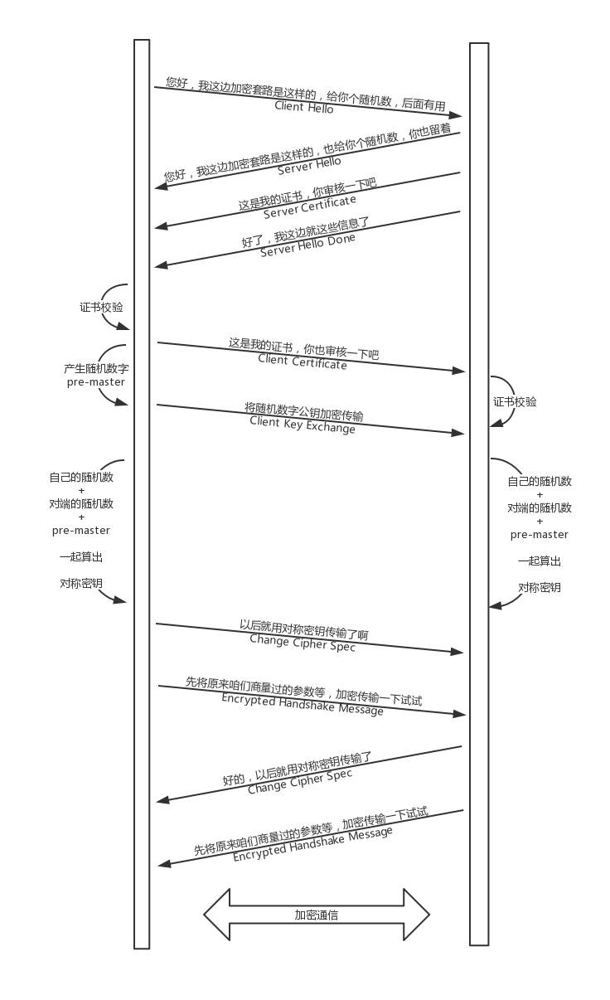

### HTTPS 的工作模式
HTTPS 是综合了对称加密和非对称加密算法的 HTTP 协议。既保证传输安全，也保证传输效率。

当你登录一个外卖网站的时候，由于是 HTTPS，客户端会发送 **Client Hello** 消息到服务器，**以明文传输 TLS 版本信息、加密套件候选列表、压缩算法候选列表等信息**。另外，还会有**一个随机数**，在协商对称密钥的时候使用。

这就类似在说：“您好，我想定外卖，但你要保密我吃的是什么。这是我的加密套路，再给你个随机数，你留着。”

然后，外卖网站返回 **Server Hello** 消息, **告诉客户端，服务器选择使用的协议版本、加密套件、压缩算法等**，**还有一个随机数**，用于后续的密钥协商。

这就类似在说：“您好，保密没问题，你的加密套路还挺多，咱们就按套路 2 来吧，我这里也有个随机数，你也留着。”

然后，外卖网站会给你一个服务器端的证书，然后说：“**Server Hello Done**，我这里就这些信息了。”

你当然不相信这个证书，于是你从自己信任的 CA 仓库中，拿 CA 的证书里面的公钥去解密外卖网站的证书。如果能够成功，则说明外卖网站是可信的。这个过程中，你可能会不断往上追溯 CA、CA 的 CA、CA 的 CA 的 CA，反正直到一个授信的 CA，就可以了。

证书验证完毕之后，觉得这个外卖网站可信，于是客户端用在数字证书里面获得的服务端的公钥计算产生**随机数字 Pre-master**，发送 **Client Key Exchange**，**用证书中的公钥加密，再发送给服务器，服务器可以通过私钥解密出来**。

到目前为止，无论是客户端还是服务器，都有了**三个随机数，分别是：自己的、对端的，以及刚生成的 Pre-Master 随机数**。**通过这三个随机数，可以在客户端和服务器产生相同的对称密钥**。

有了对称密钥，客户端就可以说：“**Change Cipher Spec**，咱们以后都采用协商的通信密钥和加密算法进行加密通信了。”

然后发送一个 **Encrypted Handshake Message**，将已经商定好的参数等，采用协商密钥进行加密，发送给服务器用于数据与握手验证。

同样，服务器也可以发送 **Change Cipher Spec**，说：“没问题，咱们以后都采用协商的通信密钥和加密算法进行加密通信了”，并且也发送 **Encrypted Handshake Message** 的消息试试。当双方握手结束之后，就可以通过对称密钥进行加密传输了。

这个过程除了加密解密之外，其他的过程和 HTTP 是一样的，过程也非常复杂。

上面的过程只包含了 HTTPS 的单向认证，也即客户端验证服务端的证书，是大部分的场景，也可以在更加严格安全要求的情况下，启用双向认证，双方互相验证证书。

### 重放与篡改

其实，这里还有一些没有解决的问题，例如重放和篡改的问题。

没错，有了加密和解密，黑客截获了包也打不开了，但是它可以发送 N 次。这个往往通过 Timestamp 和 Nonce 随机数联合起来，然后做一个不可逆的签名来保证。

**Nonce 随机数保证唯一，或者 Timestamp 和 Nonce 合起来保证唯一**，同样的，**请求只接受一次，于是服务器多次收到相同的 Timestamp 和 Nonce，则视为无效即可**。

如果有人想篡改 Timestamp 和 Nonce，还有签名保证不可篡改性，如果改了用签名算法解出来，就对不上了，可以丢弃了。
