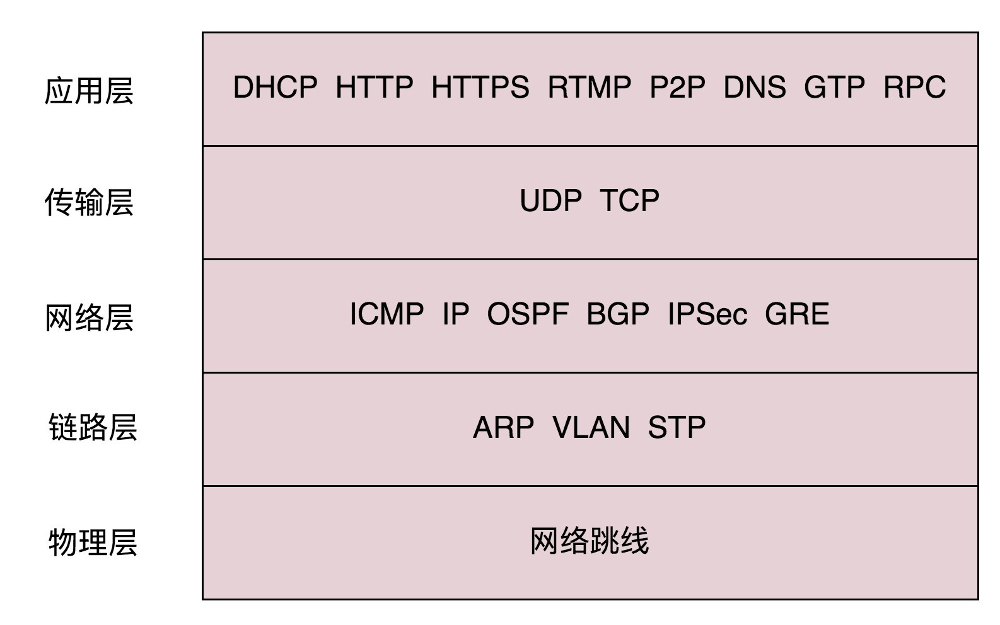

### 各层网络协议总览

### ARP协议

### RARP协议

### STP（Spanning Tree Protocol）协议
在数据结构中，有一个方法叫做最小生成树。有环的我们常称为图。将图中的环破了，就生成了树。在计算机网络中，生成树的算法叫作 STP，全称 Spanning Tree Protocol。

### ICMP 协议
ping 是基于 ICMP 协议工作的。ICMP 全称 Internet Control Message Protocol，就是互联网控制报文协议。

### 动态路由协议
#### 基于链路状态路由算法的 OSPF
OSPF（Open Shortest Path First，开放式最短路径优先）就是这样一个基于链路状态路由协议，广泛应用在数据中心中的协议。由于主要用在数据中心内部，用于路由决策，因而称为**内部网关协议（Interior Gateway Protocol，简称 IGP）**。

内部网关协议的重点就是找到最短的路径。在一个组织内部，路径最短往往最优。当然有时候 OSPF 可以发现多个最短的路径，可以在这多个路径中进行负载均衡，这常常被称为**等价路由**。

#### 基于距离矢量路由算法的 BGP
但是外网的路由协议，也即国家之间的，又有所不同。我们称为外网路由协议（Border Gateway Protocol，简称 BGP）。

### TCP协议
#### 确认与重发的机制
##### 快速重传算法
当接收方收到一个序号大于下一个所期望的报文段时，就会检测到数据流中的一个间隔，于是它就会连续发送冗余的 ACK，仍然 ACK 的是期望接收的报文段。而当客户端收到三个冗余的 ACK 后，就会在定时器过期之前，重传丢失的报文段。例如：接收方发现 6 收到了，8 也收到了，但是 7 还没来，那肯定是丢了，于是发送 6 的 ACK，要求下一个是 7。接下来，收到后续的包，仍然发送 6 的 ACK，要求下一个是 7。当客户端收到 3 个重复 ACK，就会发现 7 的确丢了，不等超时，马上重发。

##### Selective Acknowledgment  （SACK）
这种方式需要在 TCP 头里加一个 SACK 的东西，可以将缓存的地图发送给发送方。例如可以发送 ACK6、SACK8、SACK9，有了地图，发送方一下子就能看出来是 7 丢了。

### QUIC协议
