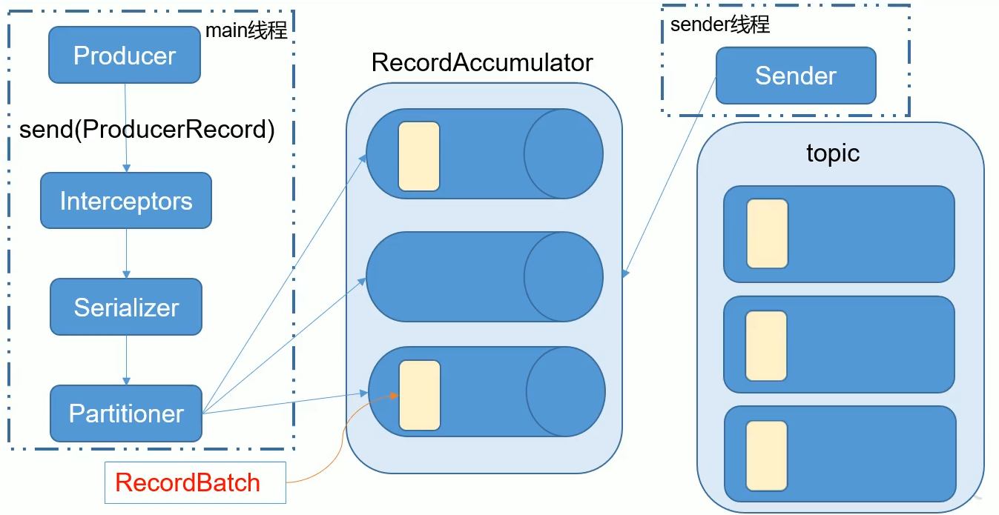

### 消息发送流程
kafka的producer发送消息采用的是**异步发送**的方式。在消息发送的过程中，涉及到了两个线程——main线程和sender线程，以及一个线程共享变量——RecordAccumulator。main线程将消息发送给RecordAccumulator，sender线程不断从RecordAccumulator中拉取消息发送到kafka broker。

### 同步发送api
同步发送的意思就是，一条消息发送后，会阻塞当前线程，直至返回ack。

由于send方法返回的是一个Future对象，根据Future对象的特点，我们也可以实现同步发送的效果，只需在调用Future对象的get方法即可。