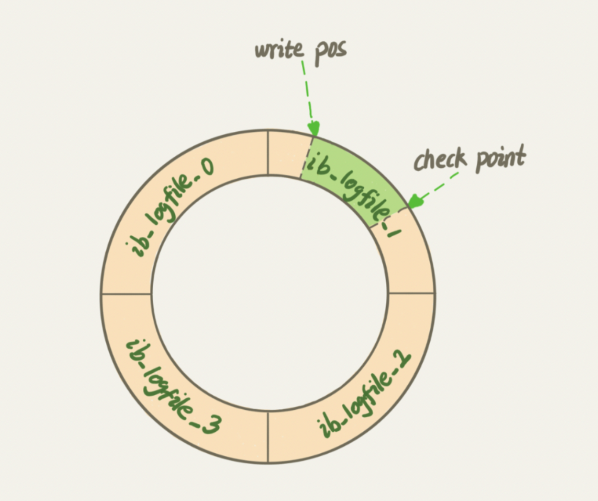

### WAL 技术
WAL 的全称是 Write-Ahead Logging，它的关键点就是先写日志，再写磁盘.

具体来说，当有一条记录需要更新的时候，InnoDB 引擎就会先把记录写到 redo log里面，并更新内存，这个时候更新就算完成了。同时，InnoDB 引擎会在适当的时候，将这个操作记录更新到磁盘里面，而这个更新往往是在系统比较空闲的时候做。

InnoDB 的 redo log 是固定大小的，比如可以配置为一组 4 个文件，每个文件的大小是 1GB，那么这块“粉板”总共就可以记录 4GB 的操作。从头开始写，写到末尾就又回到开头循环写，如下面这个图所示。

write pos 是当前记录的位置，一边写一边后移，写到第 3 号文件末尾后就回到 0 号文件开头。checkpoint 是当前要擦除的位置，也是往后推移并且循环的，擦除记录前要把记录更新到数据文件。

write pos 和 checkpoint 之间的是“粉板”上还空着的部分，可以用来记录新的操作。如果 write pos 追上 checkpoint，表示“粉板”满了，这时候不能再执行新的更新，得停下来先擦掉一些记录，把 checkpoint 推进一下。

### crash-safe

有了 redo log，InnoDB 就可以保证即使数据库发生异常重启，之前提交的记录都不会丢失，这个能力称为 crash-safe

要理解 crash-safe 这个概念，可以想想我们前面赊账记录的例子。只要赊账记录记在了粉板上或写在了账本上，之后即使掌柜忘记了，比如突然停业几天，恢复生意后依然可以通过账本和粉板上的数据明确赊账账目。
