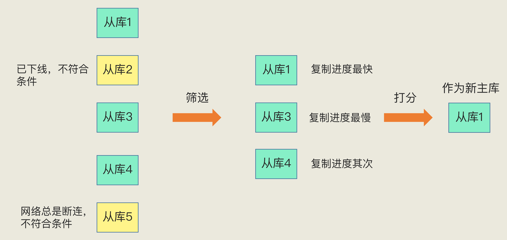

### 主从模式
Redis 提供了主从库模式，以保证数据副本的一致，主从库之间采用的是读写分离的方式。

- 读操作：主库、从库都可以接收；
- 写操作：首先到主库执行，然后，主库将写操作同步给从库。

#### 主从库间的第一次同步
当我们启动多个 Redis 实例的时候，它们相互之间就可以通过 replicaof（Redis 5.0 之前使用 slaveof）命令形成主库和从库的关系，之后会按照三个阶段完成数据的第一次同步。

例如，现在有实例 1（ip：172.16.19.3）和实例 2（ip：172.16.19.5），我们在实例 2 上执行以下这个命令后，实例 2 就变成了实例 1 的从库，并从实例 1 上复制数据：

```
replicaof  172.16.19.3  6379
```

接下来，我们就要学习主从库间数据第一次同步的三个阶段了。你可以先看一下下面这张图，有个整体感知，接下来我再具体介绍。


第一阶段是主从库间建立连接、协商同步的过程，主要是为全量复制做准备。在这一步，**从库和主库建立起连接，并告诉主库即将进行同步，主库确认回复后，主从库间就可以开始同步了**。

具体来说，从库给主库发送 psync 命令，表示要进行数据同步，主库根据这个命令的参数来启动复制。psync 命令包含了主库的 runID 和复制进度 offset 两个参数。

- runID，是每个 Redis 实例启动时都会自动生成的一个随机 ID，用来唯一标记这个实例。当从库和主库第一次复制时，因为不知道主库的 runID，所以将 runID 设为“？”。
- offset，此时设为 -1，表示第一次复制。

在第二阶段，**主库将所有数据同步给从库。从库收到数据后，在本地完成数据加载**。这个过程依赖于内存快照生成的 RDB 文件。

具体来说，主库执行 bgsave 命令，生成 RDB 文件，接着将文件发给从库。从库接收到 RDB 文件后，会先清空当前数据库，然后加载 RDB 文件。这是因为从库在通过 replicaof 命令开始和主库同步前，可能保存了其他数据。为了避免之前数据的影响，从库需要先把当前数据库清空。

在主库将数据同步给从库的过程中，主库不会被阻塞，仍然可以正常接收请求。否则，Redis 的服务就被中断了。但是，这些请求中的写操作并没有记录到刚刚生成的 RDB 文件中。为了保证主从库的数据一致性，**主库会在内存中用专门的 replication buffer，记录 RDB 文件生成后收到的所有写操作**。

最后，也就是第三个阶段，主库会把第二阶段执行过程中新收到的写命令，再发送给从库。具体的操作是，当主库完成 RDB 文件发送后，就会把此时 replication buffer 中的修改操作发给从库，从库再重新执行这些操作。这样一来，主从库就实现同步了。

#### 主从级联模式分担全量复制时的主库压力
通过分析主从库间第一次数据同步的过程，你可以看到，一次全量复制中，对于主库来说，需要完成两个耗时的操作：生成 RDB 文件和传输 RDB 文件。

如果从库数量很多，而且都要和主库进行全量复制的话，就会导致主库忙于 fork 子进程生成 RDB 文件，进行数据全量同步。fork 这个操作会阻塞主线程处理正常请求，从而导致主库响应应用程序的请求速度变慢。此外，传输 RDB 文件也会占用主库的网络带宽，同样会给主库的资源使用带来压力。

**我们可以通过“主 - 从 - 从”模式将主库生成 RDB 和传输 RDB 的压力，以级联的方式分散到从库上**。

简单来说，我们在部署主从集群的时候，可以手动选择一个从库（比如选择内存资源配置较高的从库），用于级联其他的从库。然后，我们可以再选择一些从库（例如三分之一的从库），在这些从库上执行如下命令，让它们和刚才所选的从库，建立起主从关系。

```
replicaof  所选从库的IP 6379
```

这样一来，这些从库就会知道，在进行同步时，不用再和主库进行交互了，只要和级联的从库进行写操作同步就行了，这就可以减轻主库上的压力，如下图所示：


一旦主从库完成了全量复制，它们之间就会一直维护一个网络连接，主库会通过这个连接将后续陆续收到的命令操作再同步给从库，这个过程也称为**基于长连接的命令传播**，可以避免频繁建立连接的开销。

听上去好像很简单，但不可忽视的是，这个过程中存在着风险点，最常见的就是**网络断连或阻塞**。如果网络断连，主从库之间就无法进行命令传播了，从库的数据自然也就没办法和主库保持一致了，客户端就可能从从库读到旧数据。

#### 主从库间网络断
在 Redis 2.8 之前，如果主从库在命令传播时出现了网络闪断，那么，从库就会和主库重新进行一次全量复制，开销非常大。

从 Redis 2.8 开始，网络断了之后，**主从库会采用增量复制的方式继续同步**。听名字大概就可以猜到它和全量复制的不同：全量复制是同步所有数据，而增量复制只会把主从库网络断连期间主库收到的命令，同步给从库。

那么，增量复制时，主从库之间具体是怎么保持同步的呢？这里的奥妙就在于 repl_backlog_buffer 这个缓冲区。我们先来看下它是如何用于增量命令的同步的。

**当主从库断连后，主库会一直在写repl_backlog_buffer，当从库断连又重连之后，通过psync命令告诉主库自己的slave_repl_offset，然后主库根据自己的master_repl_offset和slave_repl_offset来判断是需要全量同步还是把两者之间的命令增量同步给从库（同步的方式就是通过主库与每个从库建立连接之后的这个所谓的replication buffer）**

**repl_backlog_buffer 是一个环形缓冲区，主库会记录自己写到的位置，从库则会记录自己已经读到的位置**。

刚开始的时候，主库和从库的写读位置在一起，这算是它们的起始位置。随着主库不断接收新的写操作，它在缓冲区中的写位置会逐步偏离起始位置，我们通常用偏移量来衡量这个偏移距离的大小，**对主库来说，对应的偏移量就是 master_repl_offset**。主库接收的新写操作越多，这个值就会越大。

同样，从库在复制完写操作命令后，它在缓冲区中的读位置也开始逐步偏移刚才的起始位置，此时，从库已复制的偏移量 **slave_repl_offset** 也在不断增加。正常情况下，这两个偏移量基本相等。

主从库的连接恢复之后，从库首先会给主库发送 psync 命令，并把自己当前的 slave_repl_offset 发给主库，主库会判断自己的 master_repl_offset 和 slave_repl_offset 之间的差距。

在网络断连阶段，主库可能会收到新的写操作命令，所以，一般来说，master_repl_offset 会大于 slave_repl_offset。此时，主库只用把 master_repl_offset 和 slave_repl_offset 之间的命令操作同步给从库就行。

我们再借助一张图，回顾下增量复制的流程。


不过，有一个地方我要强调一下，因为 **repl_backlog_buffer 是一个环形缓冲区，所以在缓冲区写满后，主库会继续写入，此时，就会覆盖掉之前写入的操作。如果从库的读取速度比较慢，就有可能导致从库还未读取的操作被主库新写的操作覆盖了，这会导致主从库间的数据不一致**。

因此，我们要想办法避免这一情况，一般而言，我们可以调整 **repl_backlog_size** 这个参数。这个参数和所需的缓冲空间大小有关。缓冲空间的计算公式是：缓冲空间大小 = 主库写入命令速度 * 操作大小 - 主从库间网络传输命令速度 * 操作大小。在实际应用中，考虑到可能存在一些突发的请求压力，我们通常需要把这个缓冲空间扩大一倍，即 repl_backlog_size = 缓冲空间大小 * 2，这也就是 repl_backlog_size 的最终值。

### 哨兵集群
哨兵主要负责的就是三个任务：监控、选主（选择主库）和通知。

- 监控：通过周期性的PING命令来监控主库和从库进程是否正常工作。
- 选主：如果主库挂掉了，根据一定的规则选择一个从库实例成为新的主库。
- 通知：首先，把新主库的连接信息发给其他从库，让他们执行replicaof命令和新主库建立连接，并进行数据复制。同时，哨兵会把新主库的连接通知给客户端，让他们把请求操作发送到新主库上。

#### 主观下线和客观下线
哨兵进程会使用 PING 命令检测它自己和主、从库的网络连接情况，用来判断实例的状态。如果哨兵发现主库或从库对 PING 命令的响应超时了，那么，哨兵就会先把它标记为“主观下线”。

如果检测的是从库，那么，哨兵简单地把它标记为“主观下线”就行了，因为从库的下线影响一般不太大，集群的对外服务不会间断。

但是，如果检测的是主库，那么，哨兵还不能简单地把它标记为“主观下线”，开启主从切换。因为很有可能存在这么一个情况：那就是哨兵误判了，其实主库并没有故障。可是，一旦启动了主从切换，后续的选主和通知操作都会带来额外的计算和通信开销。

**当有 N 个哨兵实例时，最好要有 N/2 + 1 个实例判断主库为“主观下线”，才能最终判定主库为“客观下线”**

#### 如何选定新主库
一般来说，我把哨兵选择新主库的过程称为“筛选 + 打分”。简单来说，我们在多个从库中，先按照**一定的筛选条件**，把不符合条件的从库去掉。然后，我们再按照**一定的规则**，给剩下的从库逐个打分，将得分最高的从库选为新主库，如下图所示：



##### 筛选条件
1. 从库仍然在线
2. 判断从库之前的网络状态是否良好

具体怎么判断呢？你使用配置项 down-after-milliseconds * 10。其中，down-after-milliseconds 是我们认定主从库断连的最大连接超时时间。如果在 down-after-milliseconds 毫秒内，主从节点都没有通过网络联系上，我们就可以认为主从节点断连了。如果发生断连的次数超过了 10 次，就说明这个从库的网络状况不好，不适合作为新主库。

##### 打分规则
接下来就要给剩余的从库打分了。我们可以分别按照三个规则依次进行三轮打分，这三个规则分别是**从库优先级、从库复制进度以及从库 ID 号**。**只要在某一轮中，有从库得分最高，那么它就是主库了**，选主过程到此结束。如果没有出现得分最高的从库，那么就继续进行下一轮。

###### 第一轮：优先级最高的从库得分高。
用户可以通过 slave-priority 配置项，给不同的从库设置不同优先级。比如，你有两个从库，它们的内存大小不一样，你可以手动给内存大的实例设置一个高优先级。在选主时，哨兵会给优先级高的从库打高分，如果有一个从库优先级最高，那么它就是新主库了。如果从库的优先级都一样，那么哨兵开始第二轮打分。

###### 第二轮：和旧主库同步程度最接近的从库得分高。
这个规则的依据是，如果选择和旧主库同步最接近的那个从库作为主库，那么，这个新主库上就有最新的数据。

主从库同步时有个命令传播的过程。在这个过程中，主库会用 master_repl_offset 记录当前的最新写操作在 repl_backlog_buffer 中的位置，而从库会用 slave_repl_offset 这个值记录当前的复制进度。

此时，我们想要找的从库，它的 slave_repl_offset 需要最接近 master_repl_offset。如果在所有从库中，有从库的 slave_repl_offset 最接近 master_repl_offset，那么它的得分就最高，可以作为新主库。

###### 第三轮：ID 号小的从库得分高。
每个实例都会有一个 ID，这个 ID 就类似于这里的从库的编号。目前，Redis 在选主库时，有一个默认的规定：**在优先级和复制进度都相同的情况下，ID 号最小的从库得分最高，会被选为新主库**。

#### 基于 pub/sub 机制的哨兵集群组成
**哨兵实例之间可以相互发现，要归功于 Redis 提供的 pub/sub 机制，也就是发布 / 订阅机制**。

哨兵只要和主库建立起了连接，就可以在主库上发布消息了，比如说发布它自己的连接信息（IP 和端口）。同时，它也可以从主库上订阅消息，获得其他哨兵发布的连接信息。当多个哨兵实例都在主库上做了发布和订阅操作后，它们之间就能知道彼此的 IP 地址和端口。

```
在主从集群中，主库上有一个名为“__sentinel__:hello”的频道，不同哨兵就是通过它来相互发现，实现互相通信的。
```

#### 哨兵是如何知道从库的 IP 地址和端口的
**这是由哨兵向主库发送 INFO 命令来完成的**。哨兵给主库发送 INFO 命令，主库接受到这个命令后，就会把从库列表返回给哨兵。接着，哨兵就可以根据从库列表中的连接信息，和每个从库建立连接，并在这个连接上持续地对从库进行监控

#### 基于 pub/sub 机制的客户端事件通知
从本质上说，哨兵就是一个运行在特定模式下的 Redis 实例，只不过它并不服务请求操作，只是完成监控、选主和通知的任务。所以，每个哨兵实例也提供 pub/sub 机制，客户端可以从哨兵订阅消息。哨兵提供的消息订阅频道有很多，不同频道包含了主从库切换过程中的不同关键事件。

#### 由哪个哨兵执行主从切换
确定由哪个哨兵执行主从切换的过程，和主库“客观下线”的判断过程类似，也是一个“投票仲裁”的过程。

这个投票过程称为“Leader 选举”

只要满足两个条件：第一，拿到半数以上的赞成票；第二，拿到的票数同时还需要大于等于哨兵配置文件中的 quorum 值。这个哨兵就会成为最终执行主从切换的Leader
