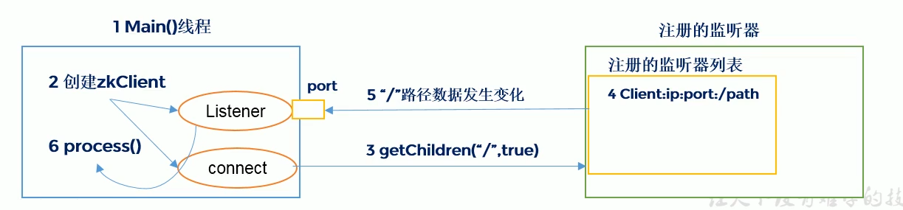
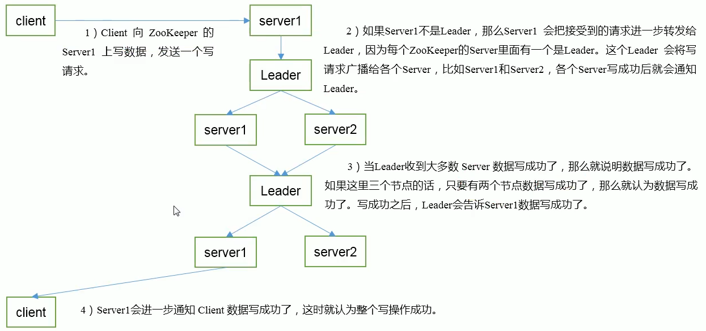

### Zookeeper内部原理
#### 选举机制
1. 半数机制：集群中半数以上机器存活，集群可用。所以Zookeeper适合安装奇数台服务器（假如有6台服务器，挂掉3台就不能运行了）。

2. Zookeeper虽然在配置文件中并没有指定Master和Slave。但是，Zookeeper工作时，是有一个节点为Leader，其他则为Follower，Leader是通过内部的选举机制临时产生的。

选票机制：
```
1.每个进入集群的服务器会先给自己投一票，如果没有选出Leader，就会把票投给myid号更大的服务器。
2.一旦集群里面有一台机器获得了超过半数的票之后，这台机器就会升级为Leader。
3.一旦有Leader诞生，后续加入的服务器就不能成为Leader了。
```

#### 节点类型
持久（Persistent）：客户端和服务器端断开连接后，创建的节点不删除

短暂（Ephemeral）：客户端和服务器端断开连接后，创建的节点自己删除

1. 持久化目录节点

客户端与Zookeeper断开连接后，该节点依旧存在

2. 持久化顺序编号目录节点

客户端与Zookeeper断开连接后，该节点依旧存在，只是Zookeeper给该节点名称进行顺序编号

说明：创建ZNode时设置顺序表示，ZNode名称后会附加一个值，顺序号是一个单调递增的计数器，由父节点维护

注意：在分布式系统中，顺序号可以被用于为所有的事件进行全局排序，这样客户端可以通过顺序号推断事件的顺序。

3. 临时目录节点

客户端与Zookeeper断开连接后，该节点被删除

4. 临时顺序编号目录节点

客户端与Zookeeper断开连接后，该节点删除，只是Zookeeper给该节点名称进行顺序编号。

#### stat结构体
1. czxid：创建节点的事务zxid

每次修改Zookeeper状态都会收到一个zxid形式的时间戳，也就是Zookeeper事务ID。事务ID是Zookeeper中所有修改总的次序。每个修改都有唯一的zxid，如果zxid1小于zxid2，那么zxid1在zxid2之前发生。

2. ctime：ZNode被创建的毫秒数（从1970年开始）

3. mzxid：ZNode最后更新的事务zxid

4. mtime：ZNode最后修改的毫秒数（从1970年开始）

5. pZxid：ZNode最后更新的子节点zxid

6. cversion：ZNode子节点变化号，ZNode子节点修改次数

7. dataversion：ZNode数据变化号

8. aclVersion：ZNode访问控制列表的变化号

9. ephemeralOwner：如果是临时节点，这个是ZNode拥有者的session id。如果不是临时节点则是0.

10. **dataLength：ZNode的数据长度**

11. **numChildren：ZNode子节点数量**

#### 监听器原理

1. 首先要有一个main()线程
2. 在main线程中创建Zookeeper客户端，这时就会创建两个线程，一个负责网络连接通信（connet），一个负责监听（listener）。
3. 通过connect线程将注册的监听时间发送给Zookeeper
4. 在Zookeeper的注册监听器列表中将注册的监听事件添加到列表中。
5. Zookeeper监听到有数据或路径变化，就会将这个消息发送给listener线程。
6. listener线程内部调用了process()方法。



常见的监听：
```
//监听节点数据的变化
get path [watch]
//监听子节点增减的变化
ls path [watch]
```

#### 写数据流程
1. Client向Zookeeper的Server1上写数据，发送一个写请求
2. 如果Server1不是Leader，那么Server1会把接受到的请求进一步转发给Leader，因为每个Zookeeper的Server里面有一个是Leader。这个Leader会将写请求广播给各个Server，比如Server1和Server2，各个Server写成功后就会通知Leader。
3. 当Leader收到大多数Server数据写成功了，那么就说明数据写成功了。如果这里有三个节点的话，只要有两个节点数据写成功了，那么就认为数据写成功了。写成功后，Leader会告诉Server1数据写成功了。
4. Server1会进一步通知Client数据写成功了，这时就会认为整个写操作成功。


